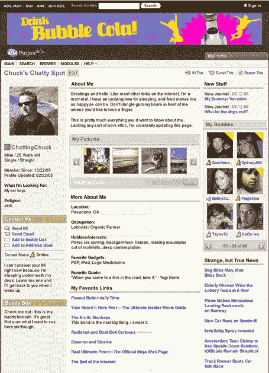

# AIM 页面:第一张截图——TechCrunch

> 原文：<https://web.archive.org/web/http://www.techcrunch.com:80/2006/05/08/aim-pages-first-screenshots/>

# AIM 页面:第一张截图

美国在线 AIM 页面的更多信息已经公布。[paid content 的 Staci Kramer](https://web.archive.org/web/20220811112332/http://www.paidcontent.org/aol-buddy-lists-social-network-expands-with-aim-pages-phoneline) 提供了一些信息，并发布了一个截图，如下。[正如我们之前报道的](https://web.archive.org/web/20220811112332/http://www.beta.techcrunch.com/2006/04/20/more-details-on-aols-myspace-killer/)，每个用户的 URL 将是 aim.com/[username]:

来自 [Staci 的帖子](https://web.archive.org/web/20220811112332/http://www.paidcontent.org/aol-buddy-lists-social-network-expands-with-aim-pages-phoneline):

> **AIM Pages:** AOL 希望成为尽可能多的用户的 24/7 大本营，因此 AIM Pages 是一个社交网站/主页/大本营，即使在好友列表离线时也保持活跃。关键受众产品营销总监凯瑞帕金斯(Kerry Parkins)称，这是 AIM 现有社交网络的“非常自然的延伸”。人们不再像经典的 AOL 那样加入一个已创建的社区，他们有自己的核心好友列表。
> 
> 与围墙花园式的经典 AOL 不同，AIM Pages 是建立在让用户从一个基地收集和连接到网络各个部分——以及彼此之间——的方式之上的。例如，用户可以添加一个 flickr 模块。“我们的方法不是让你离开 flickr，而是从 flickr 上超级设置你的内容，”帕金斯解释道。其他模块侧重于美国在线的内容，如美国在线音乐的前 11 名名单；随着更多模块的滚动引入，最初的选择将是有限的。
> 
> 当被问及是什么让 AIM Pages 从其他用户可以创建页面并形成社区的社交网站中脱颖而出时，帕金斯说，这是一个发布工具，旨在使过程更简单，结果更具吸引力。为了提高可发现性，AOL 选择了一个简单的个性化域名——www . aim . com/[screen name]。
> 
> **仍在变化:**用 AIM 页面赚钱。帕金斯承认，“广告客户自己也在试图掌握如何在这个领域赚钱。总的来说，这不是一部很棒的广告片。”他们正与广告商合作，在标准的“为《达芬奇密码》中的汤姆·汉克斯角色建立一个档案”之外扩大存在，但担心它会播放。帕金斯:“你可以围绕(一个)产品创建社区……但这是一种不同的广告模式。在我们引入一定程度的商业主义之前，我们真的希望让社区先成长起来，变得非常有活力。”与一些社交网络竞争对手不同，AIM 声称对所有人群都有“显著的影响力”。