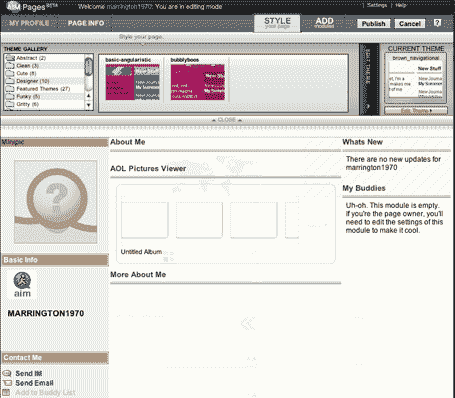

# AIM 页面发布-第一印象 TechCrunch

> 原文：<https://web.archive.org/web/http://www.techcrunch.com:80/2006/05/10/aim-pages-launches-first-impression/>

# AIM 页面发布–第一印象

过去几周我们一直在热议的 AOL Myspace 的新竞争对手 AIM Pages[今天上午在 aimpages.com](https://web.archive.org/web/20220926104117/http://www.aimpages.com/)发布。

第一印象:网站整洁有序(我不确定 Myspace 用户是否想要)，基于模块(关于我，照片等)。).模块可以被拖动到屏幕上的任何一点。它在 Firefox 上不能正常工作(或者根本不能工作)，我想这个问题会得到解决。**更新:**我在 Mac 上用的是火狐 2.0，不是 1.5。这可能是我出现问题的原因。

如果 AIM Pages 今天作为一家独立公司推出，与 AOL 没有任何关联，我会把它撕成碎片。个人发布非常容易，用户选择太多。任何新的东西都必须突出，AIM Pages 不需要。AIM Pages 是一款外观精美的 Ajax 产品，但它并没有真正提高与 Myspace、Tagworld 和其他网站的竞争。我也对它在 Firefox 中不能正常工作感到失望。现在，事实上，你的 AIM 页面将预先填充你的 AIM 好友，这是一个很大的竞争优势，我想象 AIM 将由于这一资产而取得一定程度的成功。

下面的屏幕截图。谢谢你的提示。

