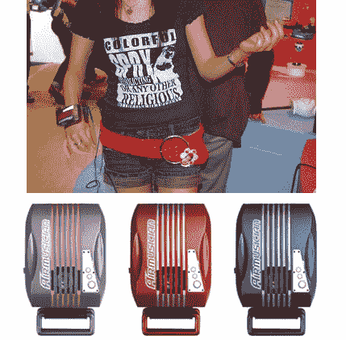

# 空气音乐家空气吉他腕带:因为你值得拥有

> 原文：<https://web.archive.org/web/http://techcrunch.com/2007/08/06/air-musician-air-guitar-wrist-strap-because-youre-worth-it/>

# 空气音乐家空气吉他腕带:因为你值得拥有

首先，[看](https://web.archive.org/web/20130628204714/http://www.mediaplayer.telegraph.co.uk/?item=8F909BF0-B31E-4A6A-A6E9-FEB176C88664)这个视频。希望你能像那个人一样酷？

本周晚些时候在日本上市的 Mad House 音乐家腕带，售价约为 16 美元，可以把你变成一个真正的假摇滚明星。只要你的手腕一直在动，乐队就会一直奏出合适的吉他节拍。有五首内置歌曲——《黑色的夜》、《水上烟雾》、《走这条路》、《20 世纪男孩》和《你会走我的路吗》？(否)或者，您可以插入自己的音频源，Airmusician 将播放该音频。重要的是要注意，所有这一切都是播放音乐时，单位正在运动；你实际上并不是在演奏单个的音符或任何东西，而是看起来更像是你选择的音乐的工具(就像视频中的那个人)。

这不会阻止我们这些工具想要尝试它。

[巨型房屋](https://web.archive.org/web/20130628204714/http://www.megahouse.co.jp/)经由[fareastgizoms](https://web.archive.org/web/20130628204714/http://www.fareastgizmos.com/other_stuff/mega_house_wrist_band_air_guitar.php)