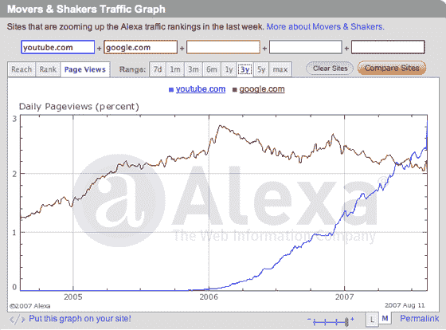
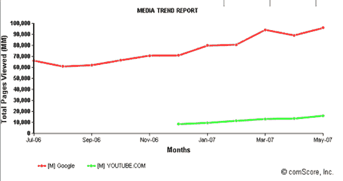

# Alexa 表示，YouTube 现在比谷歌更大。Alexa 毫无用处——TechCrunch

> 原文：<https://web.archive.org/web/http://www.techcrunch.com/2007/08/13/alexa-says-youtube-is-now-bigger-than-google-theyre-wrong/>

# Alexa 表示，YouTube 现在比谷歌更大。Alexa 没用

根据 Alexa 的数据，我们得到一些“提示”, YouTube 的浏览量已经超过了谷歌。

当然，这完全是虚构的。这表明 Alexa 作为一种测量网络流量和覆盖范围的方法已经变得多么无用。康姆斯克讲述了一个完全不同(也更准确)的故事——谷歌的月浏览量接近 1000 亿次；YouTube 看到大约 160 亿。

即使是以类似于 Alexa 的方式测量流量的新来者 Compete，似乎也做对了。Alexa 需要大修。它早就变得没用了。

对于较小的网站，Alexa 可能没有好的数据是可以理解的。但是谷歌和 YouTube 是互联网上最大的网站之一。犯这样的错误是令人尴尬的。

