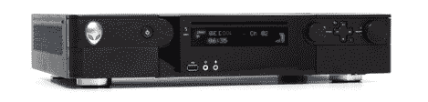

# 外星人航站 18 高清娱乐中心获得审查| TechCrunch

> 原文：<https://web.archive.org/web/http://techcrunch.com/2007/07/02/alienware-hangar18-hd-entertainment-center-gets-reviewed/>

“电脑购物者”的伙计们在外星人机场的高清娱乐中心里摸来摸去，它看起来不错，绝对值得你花 3199 美元买它。这里有一个规格的快速纲要来刷新你的记忆，因为我知道你最近被 iPhone 报道轰炸。Hangar18 包括一个 AMD Athlon X2 4600+，2GB 的 DDR2，两个 1TB 的硬盘，双层 DVD RW/DVD-RAM 光驱，nVidia GeForce7600GS (256MB)，并运行 Windows Vista Home Premium (feh！).

**优点**
华丽的设计；为欣赏高清电视提供完整的环境；丰富的输入和输出连接器。

**缺点**
光驱弹出不方便；计算能力仅仅是入门级的；不支持未加密的 QAM。

**结论**
hangar 18 专为高端媒体爱好者打造，是一款功能齐全的家庭媒体消费电脑。只是不要对它的计算端期望太高。8.6/10.

[外星人 Hangar18 高清娱乐中心台式电脑](https://web.archive.org/web/20160126223104/http://computershopper.com/reviews/alienware_hangar18_hd_entertainment_center_desktop_computer_review)【电脑购物者】