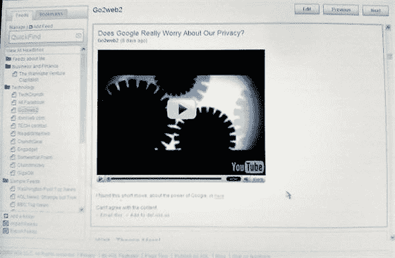
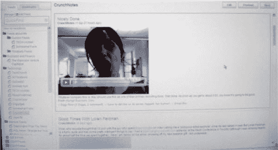

# 所有新的 AOL 订阅阅读器即将推出

> 原文：<https://web.archive.org/web/http://www.techcrunch.com:80/2007/06/06/all-new-aol-feed-reader-coming-soon/>

AOL 的 feed 阅读器于 2005 年推出，与 Bloglines、Google Reader 和其他基于浏览器的 feed 阅读器竞争，但在精通技术的人群中鲜为人知。它很好用，加载速度也很快，但它还没有从众多产品中脱颖而出，不足以引起人们对该产品的热议。我们在 2006 年 11 月[的](https://web.archive.org/web/20220626090134/http://www.beta.techcrunch.com/2006/11/08/aol-msft-goog-what-are-they-doing-in-the-sandbox/)中顺便提到了它，但除此之外没有涉及到它。该网站约有 150 万活跃用户。

然而，他们现在正准备发布一个新版本，该版本具有一些优秀的特性。

谷歌对他们的产品采取了类似的方法。当 2005 年 10 月第一次[推出](https://web.archive.org/web/20220626090134/http://www.beta.techcrunch.com/2005/10/08/google-reader-beautiful-needs-work/)时，这没什么值得大书特书的，但是该公司[在 2006 年发布了一个广受好评的新版本](https://web.archive.org/web/20220626090134/http://www.beta.techcrunch.com/2006/09/28/google-reader-steps-it-up-with-new-version)。今天，他们拥有巨大的市场份额，该产品占我们 RSS 阅读器的 34%——150，000 人通过谷歌阅读器获得 TechCrunch。

我在硅谷他们的办公室里看到了 AOL 新产品的演示。他们的产品将被称为我的最爱。

还是快。他们增加了对富媒体的支持和有用的 Ajax 技巧，使组织提要变得更加容易。他们还解决了缺乏 OPML 支持等问题。

但我最喜欢的是他们在阅读器中集成了一个新的书签产品。这些文件夹被集成到一个视图中。提要在左边栏的一个文件夹区域，书签在另一个文件夹区域。

我期待着在接下来的几个月里，当他们准备好进入测试版的时候，我能亲自测试一下。我贴了几张我在下面演示时拍的照片。他们没说我不能贴，所以给你。

