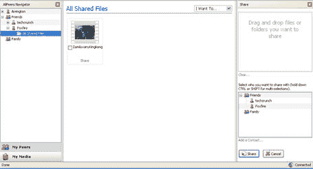
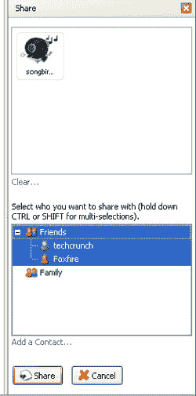

# AllPeers 来了；独家截图 

> 原文：<https://web.archive.org/web/http://www.techcrunch.com/2006/02/16/allpeers-is-coming-exclusive-screenshots/>

# AllPeers 来了；独家截图

  布拉格 [Allpeers](https://web.archive.org/web/20230219024255/http://www.allpeers.com/) 联合创始人 Matthew Gertner 今天来我家安装产品并让我试用。

Allpeers 是 Firefox 的一个扩展，可以在浏览器中创建一个简单持久的好友列表。最初，与这些好友的互动仅限于发现和共享文件——如果您愿意，您可以与一个或多个朋友共享网络上的任何文件。他们将能够看到你选择分享的文件(甚至获得你包含的新文件的 RSS 源)，并且只需点击一下就可以将其下载到他们自己的硬盘上。

更多信息请看我在 Allpeers 上的[原帖](https://web.archive.org/web/20230219024255/https://techcrunch.com/2006/01/03/allpeers-is-the-firefox-killer-app/)。

 Matt 带我完成了产品的安装和设置，并与我分享了一些文件。添加好友和共享文件的界面非常直观。将文件添加到 Allpeers 只需要将它从硬盘拖到浏览器中，共享文件只需要单击一下。

这项服务还不是免费提供的，Matt 说有 35，000 人要求在服务上线时收到电子邮件通知。

正如我之前所写的，Allpeers 是 Firefox 的“黑仔应用”——基于 Mozilla 的 Flock 和 Songbird 应该立即将基本的 Allpeers 扩展转换为在他们的平台上工作。

Allpeers 将于 2006 年 3 月底推出。

【T8

