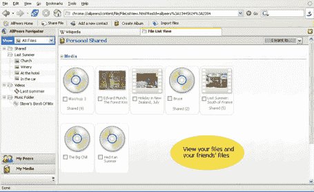

# AllPeers 是火狐的“黑仔应用”——TechCrunch

> 原文：<https://web.archive.org/web/http://www.techcrunch.com:80/2006/01/03/allpeers-is-the-firefox-killer-app/>

我有机会与 T2 创始人塞德里克·马洛克斯和马修·格特纳交谈。这家公司将席卷全球。在我看来，这个 firefox 扩展将极大地增加这个已经很受欢迎的浏览器的吸引力，吸引更多的人远离四面楚歌的 ie 浏览器。

AllPeers 是浏览器中一个简单持久的好友列表。最初，与这些好友的互动仅限于发现和共享文件——如果您愿意，您可以与一个或多个朋友共享网络上的任何文件。他们将能够看到你选择分享的文件(甚至获得你包含的新文件的 RSS 源)，并且只需点击一下就可以将其下载到他们自己的硬盘上。

AllPeers 即使在共享者离线时也能工作——all peers 是一个 bittorent 客户端，允许从多个来源获取文件。下载时，可能会从与您共享该文件的其他人(或与您共享该文件的人)那里获取部分或全部文件。所以用户只需点击一个文件，然后等待它最终下载。[屏幕截图可在此处查看](https://web.archive.org/web/20211231000354/http://www.allpeers.com/blog/2005/12/22/allpeers-screenshots/)。

有了 AllPeers，我可以与父母分享照片和家庭电影，与朋友分享歌曲(以及任何其他内容)，还可以访问他们选择分享的文件。

将来，AllPeers 也将拥有允许公共共享的文件夹(可能会有限制以控制版权侵犯)。我还假设他们也会在应用程序中内置聊天和 VOIP 功能。

所有同行都不会得到广告资助。有迹象表明，商业模式最终可能会以付费内容的货币化为中心，但这将是未来的事情。目前，他们专注于用基本的共享文件夹方法来启动。这对我来说没问题——我一拿到它就会被它迷住。

AllPeers 有七名员工，总部设在布拉格，是一家英国公司。他们是自我和天使资助至今。如果你想注册测试版，[在这里输入你的电子邮件](https://web.archive.org/web/20211231000354/http://www.allpeers.com/more_f.htm)。第一批测试人员将在本月晚些时候拿到它。

[感谢格雷格](https://web.archive.org/web/20211231000354/http://www.yardley.ca/blog/?s=allpeers&submit=Search)和[乔丹](https://web.archive.org/web/20211231000354/http://www.downloadsquad.com/2005/12/27/allpeers-file-sharing-for-firefox/)告诉我这件事。