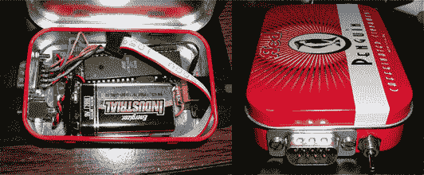

# Altoid Mod:内置流氓式视频游戏| TechCrunch

> 原文：<https://web.archive.org/web/http://techcrunch.com/2007/08/02/altoid-mod-built-in-rogue-like-video-game/>

我们偶尔会看到一些 Altoid 容器模式:一个内置 MP3 播放器，一个控制天气，一个提醒你书呆子的接近，等等。这个 mod 由 Greg Sanders 创建，里面有视频游戏*末日地牢*，是经典*盗贼*的分支。(不是说我玩过，而是我认可它的古典，发明一个词。)

一个世嘉创世纪控制器控制着游戏，它的原理图随时可供你欣赏。

[Mod 页面](https://web.archive.org/web/20140412115402/http://instruct1.cit.cornell.edu/courses/ee476/FinalProjects/s2005/gts7/index.html)【桑德斯之家 via [Make 博客](https://web.archive.org/web/20140412115402/http://www.makezine.com/blog/archive/2007/08/dungeons_of_doom_by_greg.html?CMP=OTC-0D6B48984890)