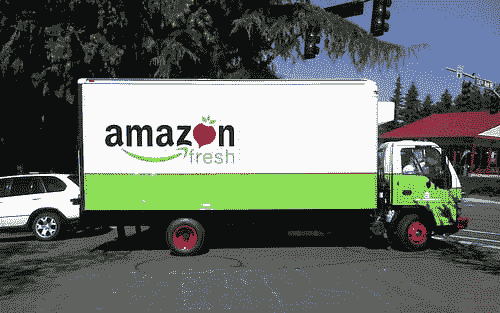

# 野外发现的亚马逊新鲜购物袋 

> 原文：<https://web.archive.org/web/http://www.techcrunch.com:80/2007/08/16/amazon-fresh-shopping-bag-spotted-in-the-wild/>

# 野外发现的亚马逊新鲜购物袋

最后，[图片](https://web.archive.org/web/20230131200146/http://www.daily-nonsense.com/BobPhotos/)开始出现[亚马逊生鲜](https://web.archive.org/web/20230131200146/http://techcrunch.com/2007/08/01/remember-webvan-so-does-amazon/)，这是上个月在西雅图推出的类似网络货车的新型杂货递送服务。我真正想看到的是住在西雅图的人对这项服务的评论。还有一张大家都在看的送货车的照片。或者更好的是，把整个送货过程都拍下来。我对 Webvan 有着非常美好的回忆，我迫不及待地想看到它在硅谷上市。我再也不用离开我的电脑了。

**更新:** [这是](https://web.archive.org/web/20230131200146/http://www.jeffsandquist.com/AmazonToOpenGroceryServiceAmazonFresh.aspx)卡车——照片归功于 Jeff Sandquist:

