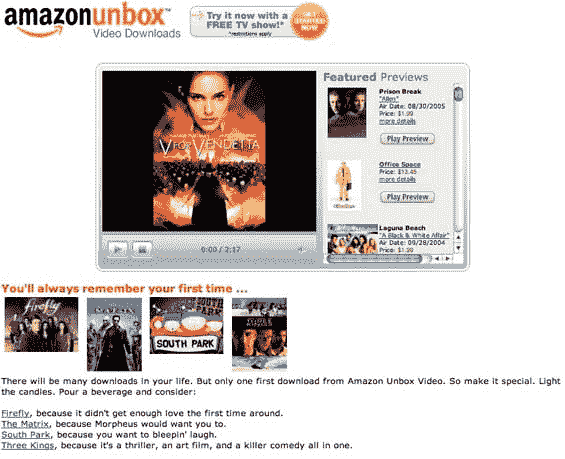

# 亚马逊拆箱上线| TechCrunch

> 原文：<https://web.archive.org/web/http://www.techcrunch.com:80/2006/09/07/amazon-unbox-goes-live/>

  亚马逊的电影下载网站，名为 [Unbox](https://web.archive.org/web/20230225204154/http://unbox.com/) ，今天似乎已经上线。亚马逊的首页上还没有链接，但是在 unbox.com 的直接链接是有效的。上个月我们报道了该网站的早期预览。演出可以购买或租借。对于购买，电视剧集是 1.99 美元，大多数电影在 8 美元到 15 美元之间，有些是 20 美元。斯派克·李的[做正确的事](https://web.archive.org/web/20230225204154/http://www.amazon.com/Do-the-Right-Thing/dp/B000I9VOGW/sr=1-1/qid=1157669939/ref=sr_1_1/102-0993985-1617708?ie=UTF8&s=digital-video)是 36 美元。(更新——已改为 16 美元。)租金为 1.99 美元或 2.99 美元。

每次购买的视频都包括适合在大屏幕(PC 或电视)上播放的 DVD 质量的视频文件，以及 Windows Media 视频便携式设备的视频文件。视频在下载开始后不久就开始播放，估计延迟时间从电缆连接的两分钟半到 DSL 线路的六十分钟不等。*注意:*一些用户报告说，在服务上线后，他们很早就开始播放下载的文件。

视频下载竞争越来越激烈，值得注意的是亚马逊抢先了 iTunes 一步。预计苹果公司将于下周宣布视频下载量，并可能在价格上低于亚马逊，新发布的视频最高价格为 15 美元。

亚马逊在苹果进入电影下载游戏之前推出这项服务是明智的。然而，亚马逊提供的服务有很大的局限性。观看视频需要桌面软件，而且只能在 Windows 上观看。除了作为备份，视频不能刻录到 DVD 上，也不能在 DVD 播放器上播放。此外，对于租赁，您必须在下载后 30 天内观看视频，并在开始观看后 24 小时内观看。更新:早期的报道称[可用的 DRM 剥离软件](https://web.archive.org/web/20230225204154/http://www.engadget.com/2006/08/25/fairuse4wm-strips-windows-media-drm/)正在拆箱内容。这里不是背书，只是说明。天知道你不能因为付了钱就把电影带到你朋友家。想了解更多关于这个问题的新闻，请看[这个连线故事](https://web.archive.org/web/20230225204154/http://www.wired.com/news/columns/0,71738-0.html)。

