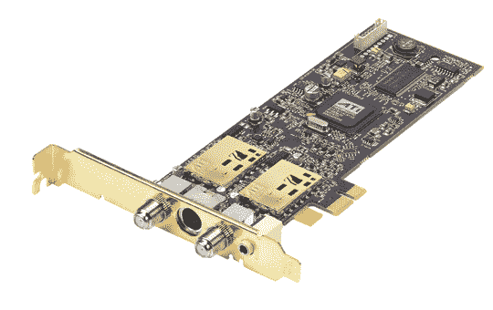

# AMD 的两个电视调谐神狗

> 原文：<https://web.archive.org/web/http://techcrunch.com:80/2007/07/09/amds-two-tv-tuning-wonder-dongles/>

AMD 将通过把你的个人电脑转变成一个功能丰富的家庭影院来颠覆你的世界。两个 ATI TV Wonder USB 加密狗的引入将把您的 PC 或笔记本电脑转换为您的高清内容的 DVR。

TV Wonder 650 Combo PCIe 让您能够录制您的有线和本地广播，同时如果您想对您的有线电视盒说“再见”，还可以通过 ClearQAM 调谐录制 QAM 电台(假设您的有线电视提供商支持此类活动)。“650 还为您提供了在观看或录制模拟电视频道的同时录制数字电视节目的选项。

TV Wonder 600 USB 套件可通过 A/V 输入适配器跨多个平台工作，以从您的 VCR 录制视频(那是什么？)和摄像机。它包括一个信用卡大小的红外遥控器，谁不需要在沙发垫上再丢一个东西呢？

我确信这两者都将发挥巨大的作用(或者至少我在新闻稿中读到的是这样)，对于那些目前正在使用或考虑使用他们的 PC 或笔记本电脑作为媒体中心的人来说，请注意，因为这可能会让你的生活更容易。两款都将于 9 月发布。

[新闻稿](https://web.archive.org/web/20150908130239/http://www.amd.com/us-en/Corporate/VirtualPressRoom/0,,51_104_543~118252,00.html)