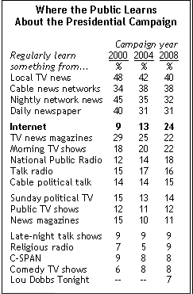

# 美国:日益扩大的数字鸿沟 TechCrunch

> 原文：<https://web.archive.org/web/http://www.techcrunch.com:80/2007/05/06/america-the-growing-digital-divide/>

# 美国:日益扩大的数字鸿沟

皮尤互联网&美国生活项目发布的一项新研究 (pdf)发现，美国的数字鸿沟正在扩大。

John B. Horrigan 对美国使用 Web 2.0 和广义信息通信技术的分析表明，虽然相当数量的美国人正在接受新技术和 Web 2.0，但令人不安的是，有相当数量的人要么没有得到信息，要么选择不参与。

31%的美国人被认为是“精英科技用户”，其中 49%的人几乎没有科技资产，要么只是偶尔接触网络世界，要么根本不接触。

8%的人被认为是“杂食者”，该研究将其描述为 Web 2.0 专用，高度参与在线视频和数字内容；“网络空间的创造性参与者”。

关机因素严格来说是年龄问题吗？这项研究发现，前 8%的人都很年轻，种族多样，而且大部分是男性(70%)。最富有的 8%人群的平均年龄为 28 岁，其中一半以上不到 30 岁。底层 15%的人年龄更大并不奇怪，他们的中值年龄为 64 岁——作为一个群体，他们的家庭收入水平最低。然而，这个群体并没有完全关闭:82%的人每天看电视，76%的人有有线或卫星服务，在研究中，他们看电视或听广播的水平最高；只是没有使用 Web 2.0。

很容易得出结论，作为一个行业，我们的信息没有得到应有的传播。然而，从这些数字中，我实际上被这样一个事实所吸引，即对于那些没有参与的人来说，如此高的报告数字是一个等待发生的机会。在这 31%膨胀到接近 100%之前，不可能有市场饱和。

正如著名的任天堂 Wii 所展示的那样，瞄准非硬核市场能够也确实有其回报。