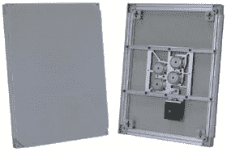

# Amina Tech 的隐形石膏墙扬声器

> 原文：<https://web.archive.org/web/http://techcrunch.com:80/2006/08/23/amina-tech%E2%80%99s-soundunseen-plaster-in-wall-speakers/>

# Amina Tech 的隐形石膏墙扬声器

Amina Tech 的 sound invisible plastin-In-Wall 扬声器是高功率振动元件平板扬声器，可以完全贴在墙上或天花板上，可以产生高清晰度的声音，没有任何干扰。扬声器不仅摆脱了明显的布线和房间杂乱，而且它们采用了有趣的设计，使扬声器的位置和收听位置非常灵活。

> “扬声器采用轻质复合材料设计，其振动方式与原声乐器相同，与传统扬声器相比，扬声器能够以方向性更弱、更均匀的方式再现声音能量的扩散源。”

不管您在什么类型的房间，也不管扬声器设置在哪里，它们都可以重新创建环绕声或立体声声场设置。扬声器携带一个独立的引擎，允许扬声器产生微小的强有力的振动，这种振动可以通过任何表面覆盖物传递。振动导致空气分子振动，并进一步激发它们，将清晰的声波送入房间。

暂无定价，敬请关注。

[阿米纳科技](https://web.archive.org/web/20210302022955/http://www.amina.co.uk/)【产品页面】