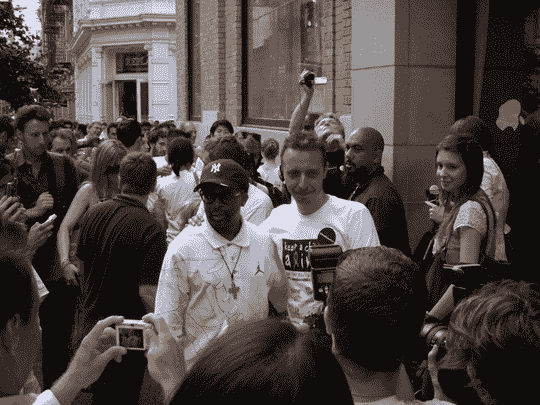
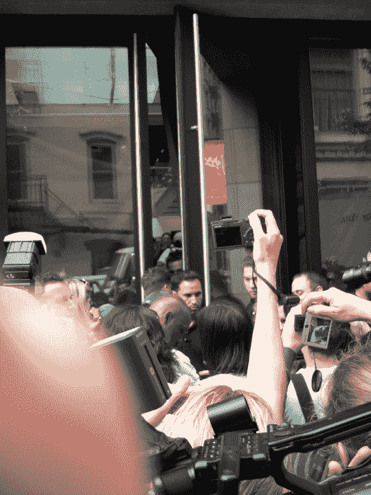
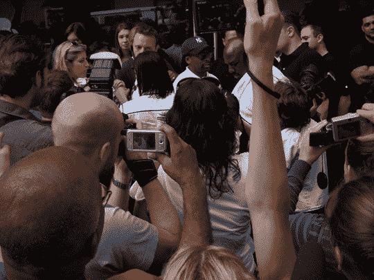
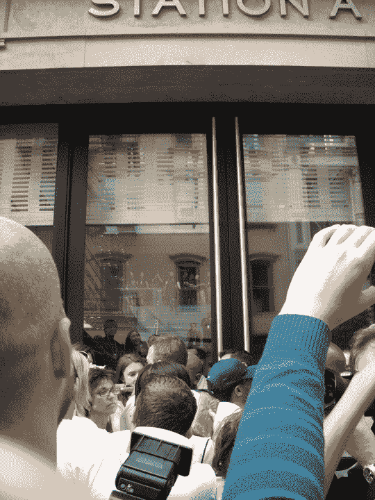
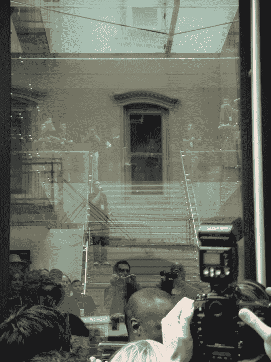
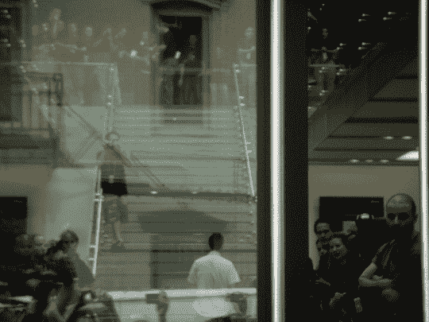
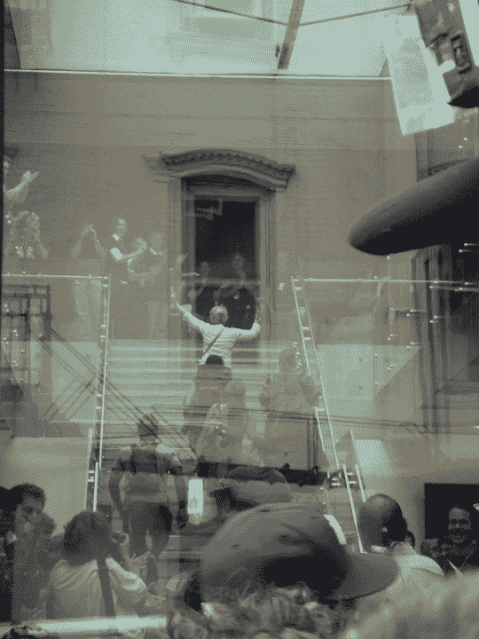
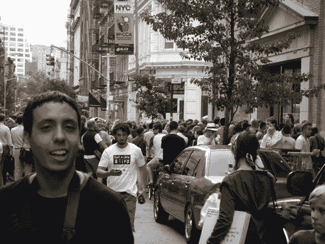

# 带有尖刻字幕的每日回顾展

> 原文：<https://web.archive.org/web/http://techcrunch.com/2007/06/29/an-iday-retrospective-with-snarky-captions/>

斯派克·李先生出来支持[保住一个孩子基金会](https://web.archive.org/web/20130628155336/http://crunchgear.com/2007/06/26/charity-benefits-from-iphone-madness/)。我们知道他只是想自己得到一个。

尼古拉斯和我想逃离位于高谭市第五大道苹果商店的混乱，去一个更加宁静和舒适的 SoHo 区。这是你一天中所能梦想和想要的一切。成吨的游客不知道发生了什么，但想参与疯狂的美国人对势利的时髦时髦的人做的任何事情，这些人窃笑和嘲笑那些浪费时间排队等候或拍照的人。他们暗地里想要一个，但知道他们不能承认，所以他们哭着跑回威廉斯堡的家。我们的发现是惊人的，也是愚蠢的。难道今天你不想在我的眼中进行一次旅行吗？

到底怎么回事？！我明白了……苹果员工。呸。！！

我希望能先睹为快，但我没有这样的运气。这一天对我来说并不幸运。也许在别的时间，在别的地方，在别的日子。

斯派克·李走进商店。

当他们开门让斯派克进来时，我的心怦怦直跳。几乎和昨晚看[变形金刚](https://web.archive.org/web/20130628155336/http://crunchgear.com/2007/06/29/exclusive-transformers-footage-from-last-nights-screening/)一样神奇。

哦，不，他们要关门了！

当大门慢慢开始下降时，我的心也跟着下降。这一切都是为了吸引媒体关注的卑鄙伎俩吗？iPhone 只是一个骗局？

芝麻开门

现在是美国东部时间下午 6 点，iPhone 即将发布。耶！！！我差点尿裤子了。

他在说我们什么？

这位先生出现在玻璃楼梯上，很可能是在召集军队，准备对付几天没洗澡的臭烘烘的恶心人。“他们经过时，你只要屏住呼吸就行了。站在一起！”

他在做我们正在做的事。

这个年轻人正在做我们正在做的事情。很奇怪。我好像摔倒了。

我在哪？你是谁？比利，是你吗？

这个老人不知道她在做什么。我相信她认为有个怪物在追她上楼。她显然是从家里逃出来的，并且进入了队伍。

终于结束了！！！

我希望你喜欢我和尼古拉斯在 SoHo 商店的旅行。我们没有找到宁静，但我们确实找到了一群 bafoons 站在周围，拍了数千张斯派克·李的照片，没有明显的理由就推来推去。东海岸的 iPhone 覆盖正式结束。我希望你们都开心，因为我知道我很开心。我们终于可以回到我们定期安排的博客了。祝大家周末愉快！