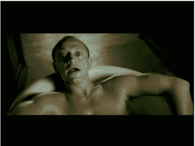

# 另一则广告让索尼陷入困境

> 原文：<https://web.archive.org/web/http://techcrunch.com/2007/08/08/another-ad-gets-sony-in-trouble/>

*又一次*索尼发现自己因为一则广告而陷入麻烦。天哪，索尼，已经吸取教训了！这一次，在禁令盛行的英国，PS3 的一则广告显然“美化”了暴力或反社会行为，对社会结构的破坏性如此之大，以至于该国的广告标准管理局(哇……)禁止了它。没了，广告就不存在了。好像那边的 [*黑衣人*](https://web.archive.org/web/20131125021434/http://youtube.com/watch?v=aiNbBeJ1Ewg) 。

这则广告引发了整整 23 起投诉，在一个 6000 万人口的国家，这意味着它需要被删除，即使索尼的广告针对的是成年人。“我杀过更少的人”这句话特别烦人。这个不是问题中的广告，但它来自同一个系列。

我期待很多“哈哈，索尼烂透了”的评论。就我个人而言，我认为整个“索尼很棒”的说法已经过时了。我们明白了:你不喜欢索尼。

[暴力 Playstation 3 Ad 封杀](https://web.archive.org/web/20131125021434/http://www.lse.co.uk/ShowStory.asp?story=BZ840633T&news_headline=violent_playstation_3_ad_banned_)【生活方式 Extra via [次世代](https://web.archive.org/web/20131125021434/http://www.next-gen.biz/index.php?option=com_content&task=view&id=6745&Itemid=2)