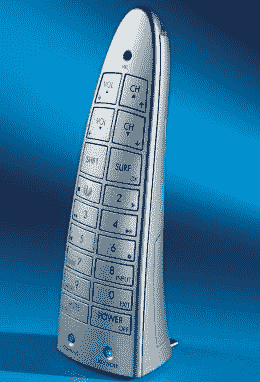

# 赖床的另一个原因:语音命令通用遥控器

> 原文：<https://web.archive.org/web/http://techcrunch.com:80/2007/07/30/another-reason-to-stay-in-bed-the-voice-command-universal-remote-control/>

起床还有什么意义呢？就像科技想要改善我们原本活跃的生活方式一样，我们也可能会在有生之年卧床不起。嘘。

语音命令通用遥控器。还需要我多说吗？好吧。Hammacher Schlemmer 的最新产品通过您的声音与您的电视、VCR、DVR、DVD、有线电视盒和卫星配合使用。它预编程有基本的命令，因为，让我们面对它，你太懒了，甚至不这样做。现在只需 49.95 美元就可以买一个。当它丢在沙发垫里的时候你会怎么做？

[产品页面](https://web.archive.org/web/20141014044431/http://www.hammacher.com/publish/73517.asp?source=CJ&cm_mmc=CJ-_-1923472-_-2197747-_-Hammacher+Product+Catalog)