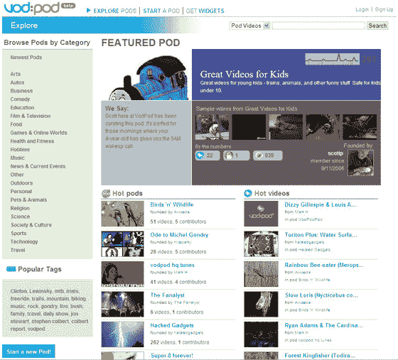

# 另一个社交网络视频网站 

> 原文：<https://web.archive.org/web/http://www.techcrunch.com:80/2006/12/04/another-social-networking-video-site/>

# 另一个社交网络视频网站

 [VodPod](https://web.archive.org/web/20230207093426/http://vodpod.com/beta_home) 今天从《私人阿尔法》出来进入 beta 模式。这是一个社交网络视频分享网站，现在你可能会想，‘为什么我们需要另一个 YouTube？’？“嗯，如果 [YouTube](https://web.archive.org/web/20230207093426/https://techcrunch.com/tag/YouTube/) 变得越来越商业化，就像看起来的那样，那么用户生成的视频将需要一个新家。

VodPod 主要是围绕社交网络设计的。喜欢鸟吗？加入鸟“荚”，你会有一个观鸟视频的即时收集。比如单循环？一些来自澳大利亚的孩子也开始围绕这一娱乐活动成立了一个小组。用户可以加入多个群组，这些群组围绕各种主题聚集视频，允许他们发布和收集与该主题相关的新视频。虽然你不必加入一个 Pod，甚至不必注册 VodPod 来搜索 pod 视频。用户可以在没有社交网络的情况下匿名“潜伏”在豆荚里。

添加到 pod 的视频不必是原始 VodPod 材料。它们可以来自其他共享网站，如 YouTube，使用嵌入代码。

“基本上，它允许你从 MySpace 或 YouTube 或互联网上的 100 多个网站上找到的视频中建立一个视频集，或者你可以将自己的视频作为主机放在 VodPod 上，然后建立它们的混合。”VodPod 的三位创始人之一马克·霍尔在上周五的电话简报中说。

霍尔和他的合作伙伴是 Last.fm 的忠实粉丝，希望创造一种类似的体验，让用户可以建立有相似品味的朋友网络，并观看他们观看的内容。虽然，用户不一定能看完朋友看的所有东西，因为有可能将某些视频标记为隐私，让别人无法知道你看过。

VodPod 的开发始于今年夏天的旧金山，该公司在那里得到了私人投资。Linden Labs 和第二人生的创始人兼首席执行官 Philip Rosedale 和拥有 WordPress 的 Automattic 的首席执行官 Toni Schneider 都是公司的外部顾问。

