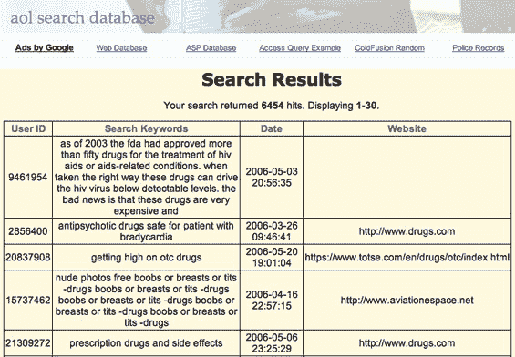

# 美国在线数据:第一个网络界面

> 原文：<https://web.archive.org/web/http://www.techcrunch.com:80/2006/08/08/aol-data-first-web-interfaces-up/>

# AOL 数据:第一个 Web 界面启动

美国在线上周发布了 2000 万个搜索查询，有人为这些查询建立一个简单的网络界面只是时间问题(见[美国在线骄傲地发布了大量私人数据](https://web.archive.org/web/20230221222331/https://techcrunch.com/2006/08/06/aol-proudly-releases-massive-amounts-of-user-search-data/)，以及[美国在线:“这是一个错误”](https://web.archive.org/web/20230221222331/https://techcrunch.com/2006/08/07/aol-this-was-a-screw-up/))。

一位[评论者](https://web.archive.org/web/20230221222331/https://techcrunch.com/2006/08/06/aol-proudly-releases-massive-amounts-of-user-search-data/#comment-127418)在我们最初的帖子上写道:

> 这有些东西你们可能会喜欢。我做这个是为了帮助那些不想浏览 2g 文件的人。这是一个可搜索的 mySQL 数据库，包含了这些搜索(大部分搜索，无论如何，我还没有完成索引)，删除了所有冗余，可按类别搜索。希望这能带来几个小时的乐趣。

他们甚至挑选了一个合适的域名，并花时间将其包装在谷歌广告中。参见[AOLSearchDatabase.com](https://web.archive.org/web/20230221222331/http://www.aolsearchdatabase.com/)通过用户 ID、搜索词、搜索日期或网站结果搜索数据。下面是结果的屏幕截图。

我今天还和发布道歉声明的 AOL 发言人安德鲁·温斯坦通了电话。他对发生这种事情感到非常愤怒，并说当他在周日晚上发现这一失败时，他和其他人一样感到惊讶。作为一个有趣的补充说明，他说他第一次听到这个消息是在我最喜欢的网站之一的 TechMeme 上，并立即联系了发布数据的 AOL 员工和高管团队来处理这个问题。打完电话后，我首先想到的是，他们为什么不找一个像安德鲁这样的人来管理 AOL 客户服务呢？

