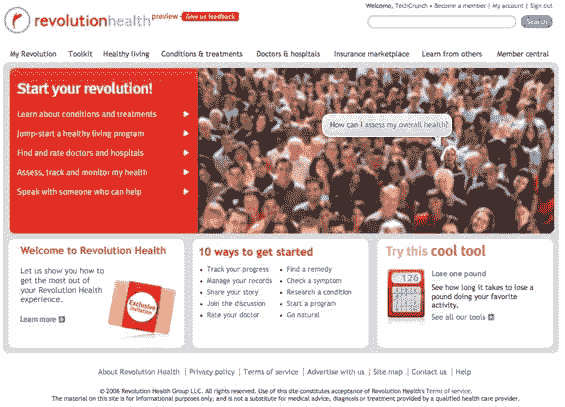

# 美国在线创始人的下一个创业公司:革命健康 

> 原文：<https://web.archive.org/web/http://www.techcrunch.com:80/2007/01/03/aol-founders-next-startup-revolution-health/>

# 美国在线创始人的下一个创业:革命健康

  美国在线联合创始人史蒂夫·凯斯于 2005 年离开时代华纳(美国在线的母公司)，他已经有效地启动了他的下一个创业公司——[革命健康](https://web.archive.org/web/20221003221445/http://www.revolutionhealth.com/)。域名仍然显示一个登陆页面，但是[预览站点](https://web.archive.org/web/20221003221445/http://www.revolutionhealth.com/preview?code=yW3qAM5zcW)对所有人开放。

Revolution Health 不是一个健康搜索引擎，与 2005 年末推出的垂直健康相关搜索引擎 [Healthline](https://web.archive.org/web/20221003221445/http://www.beta.techcrunch.com/tag/healthline) 或最近的健康搜索初创公司 [Medstory](https://web.archive.org/web/20221003221445/http://www.medstory.com/) 明显不同。

革命健康是一个健康相关的门户网站和社会网络。用户被鼓励提问和回答其他用户的问题，评价他们的医生，参与在线讨论，或者贡献内容。该网站也有许多帮助人们变得更加健康的工具，比如一个计算器，显示你需要做多长时间才能减掉一磅体重，还有一个工具显示如果你戒烟，你会节省多少钱。

每个用户都有一个个人资料页面，他们可以在这里链接到其他用户，设定个人目标，并汇总他们贡献给网站的内容。

