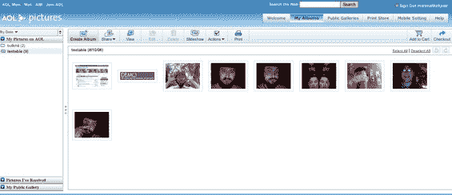

# 美国在线影业走向社会化，但这并不美好

> 原文：<https://web.archive.org/web/http://www.techcrunch.com:80/2006/09/27/aol-pictures-goes-social-and-its-not-pretty/>

# 美国在线电影公司走向社会化，这并不美好

[美国在线影业](https://web.archive.org/web/20220820063116/http://pictures.aol.com/)的新版本今天从测试版出来[并且它是彻底地令人失望的。从 Web 2.0 的角度来看，新功能基本上是所有标准的社交事物——公共图库、Ajax、标签、评论和订阅——但没有一个做得特别好。他们被雅虎搞得很惨。、Webshots 和 Photobucket。](https://web.archive.org/web/20220820063116/http://journals.aol.com/aolpictures/aolpictures/entries/2006/09/27/a-new-way-to-share/1420)

新的 AOL Pictures 提供了一个图片编辑器，但只针对 Windows，Ajax 响应速度很慢，标签得到支持，但不是以一种有意义的方式(它实际上仍然是关于文件夹的)，照片库可以命名，但只能命名，该网站基本上没有使用乐趣。这项服务或许应该在测试阶段停留一段时间。我说过它看起来不太好看吗？

新的雅虎！照片上个月[出来](https://web.archive.org/web/20220820063116/http://www.beta.techcrunch.com/2006/08/17/yahoo-photos-to-leave-beta-today-api-finally-coming/)更好，但是 Flickr 还是好得多。如果你打算跟随 Flickr 的脚步，就像每个人似乎都在做的那样——至少要做好。或者找一个做一些真正有趣的事情的人。在线视频编辑是视频分享和雅虎最明显的下一个方向。今早刚买的 Jumpcut。有许多有趣的小照片分享网站，至少在艺术水平上比 AOL 图片做得更好。我头顶上的两位是[Photoblog.com](https://web.archive.org/web/20220820063116/http://www.photoblog.com/)和[泡泡共享](https://web.archive.org/web/20220820063116/http://www.bubbleshare.com/)(他们正在做[一些非常酷的事情](https://web.archive.org/web/20220820063116/http://www.beta.techcrunch.com/2006/07/07/bubbleshare-live-brings-screen-sharing-to-photos/))。Zooomr 显然也在上市。

[美国在线视频](https://web.archive.org/web/20220820063116/http://video.aol.com/)远比这个有趣，它混合了商业和用户生成的内容、长长的电影工作室合作伙伴名单和[欢跃交易](https://web.archive.org/web/20220820063116/http://www.beta.techcrunch.com/2006/09/17/aol-to-send-movies-to-your-tv/)。

也许许多 AOL 客户不想要任何花哨的东西，但这看起来像是一种半心半意的努力，以赶上竞争对手，我猜不会受到欢迎。
 **更新:**这里应该提到过该服务提供免费无限存储。由于我对用户界面的不满，这一点被忽略了，但它很重要。
