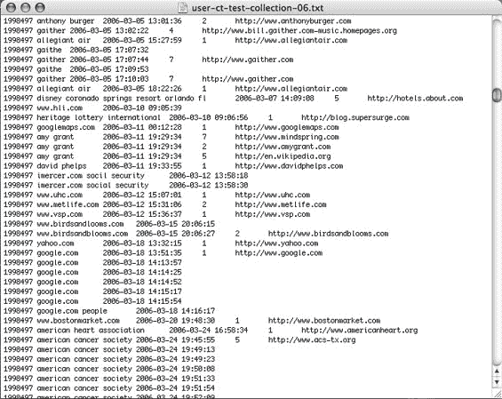

# 美国在线自豪地发布大量私人数据

> 原文：<https://web.archive.org/web/http://www.techcrunch.com:80/2006/08/06/aol-proudly-releases-massive-amounts-of-user-search-data/>

**又一次更新:** [美国在线:“这是一个错误”](https://web.archive.org/web/20230329140909/https://techcrunch.com/2006/08/07/aol-this-was-a-screw-up/)

**进一步更新:**晚上 7 点以后，下载链接也关闭了，但至少还有一个[镜像站点](https://web.archive.org/web/20230329140909/http://www.gregsadetsky.com/aol-data/)。AOL 处于损害控制模式——他们删除数据的事实表明，有人意识到这是多么具有破坏性，但这也是对各种不法行为的承认。无论哪种方式，数据现在对任何想使用(或滥用)它的人都是公开的。

**更新:**太平洋时间周日晚上 7 点左右，下面提到的 [AOL 网站](https://web.archive.org/web/20230329140909/http://research.aol.com/pmwiki/pmwiki.php?n=Research.500kUserQueriesSampledOver3Months)被关闭。与数据的直接链接仍然有效。页面的缓存副本在这里是。

美国在线一定没有注意到去年 DOJ 要求“匿名化”搜索数据引起的骚动，那场骚动给微软和谷歌带来了各种各样的痛苦。这是解释他们发布数据的唯一方法，这些数据包括来自 65 万美国在线用户的 2000 万次网络查询。

这些数据包括这些用户今年三个月内的所有搜索，以及他们是否点击了某个结果，该结果是什么，以及它出现在结果页面的什么位置。这是一个 439 MB 的压缩下载，扩展到 2g 多一点。数据在[这里](https://web.archive.org/web/20230329140909/http://research.aol.com/pmwiki/pmwiki.php?n=Research.Research?action=downloadman&upname=500kusers.tgz)可用(这个链接是直接到文件的)，输出是十个文本文件，tab 描绘。

这种绝对的愚蠢令人震惊。美国在线在未经用户允许的情况下发布了用户的非常隐私的数据。虽然 AOL 用户名已经被改成了一个随机的 ID 号，但是由一个用户分析所有搜索的能力通常会使人们很容易地确定这个用户是谁，以及他们在做什么。这些数据包括个人姓名、地址、社会保险号以及其他任何人可能在搜索框中输入的信息。

最严重的问题是，许多人经常搜索自己的名字，或者他们的朋友和家人的名字，看看在网上有什么关于他们的信息。将这些自我搜索和色情查询结合起来，你会非常尴尬。将它们与“购买摇头丸”结合起来，你就有了犯罪的证据。将它与地址、社会保险号等结合起来。，你就有一个身份盗窃案等着发生。可能性是无限的。

营销人员对这些可能性变得疯狂，用户呼吁 T2 抵制美国在线，其他人只是被 T4 激怒了:

> 用户 491577 搜索“florida cna pca lakeland tampa”、“emt school training florida”、“低卡路里膳食”、“婴儿座椅”和“fisher price 滚轴溜冰鞋”。在用户 39509 的数百个搜索中，有:“福特 352”，“俄克拉何马州有纪律的牧师”，“俄克拉何马州有纪律的医生”，“房屋贷款”，以及其他一些个人识别和非法的东西，我将从这里删除。在用户 545605 的搜索中有“shore hills park mays landing nj”、“frank william sindoni md”、“陶瓷烟灰缸”、“向中国汇款”和“出售房屋的资本收益”。与一些数据相比，这些例子是安全的。我省略了最糟糕的部分——搜索特定人的名字、地址、电话号码、非法药物等等。毫无疑问，执法部门、雇主或朋友可以找出这些人是谁。

在这些数据中有一些真正可怕的东西。

我假设 AOL 将很快关闭这个页面和数据，但是在这篇文章发表的时候，它已经被下载了 809 次。与我交谈过的人已经在建立一个数据的网络接口。如果你是 AOL 的客户，我为你感到难过。

请注意，微软[已经提议](https://web.archive.org/web/20230329140909/http://research.microsoft.com/ur/us/fundingopps/RFPs/Search_2006_RFP.aspx)向研究人员发布类似的数据，尽管有一个重要的区别——数据与用户无关。Excite [发布的数据](https://web.archive.org/web/20230329140909/http://informationr.net/ir/6-1/paper90.html)与 AOL 在 1999 年发布的用户关联数据非常相似。

就品牌形象而言，美国在线正跌至谷底。这个故事发生在[电话录音](https://web.archive.org/web/20230329140909/http://www.youtube.com/watch?v=xIVZ9b0RgmY)客服灾难之后，以及[刚刚发生的故事](https://web.archive.org/web/20230329140909/http://www.stltoday.com/stltoday/business/columnists.nsf/techtalk/story/A0F7FD49EFA6565A862571BF006C005A?OpenDocument)关于一个女人在她死去的父亲去世九个月后无法注销他的 AOL 账户。

