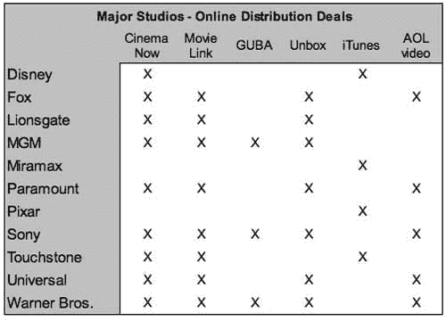

# 美国在线视频加入派拉蒙，产品仍然落后于市场

> 原文：<https://web.archive.org/web/http://www.techcrunch.com:80/2006/10/24/aol-video-adds-paramount-product-still-lags-market/>

美国在线视频(AOL Video)今天宣布增加派拉蒙电影公司的电影，加入他们来自福克斯、索尼、环球和华纳兄弟的电影目录。他们现在提供来自主要电影工作室的 300 多部电影。

我们上周写了关于[主要电影下载服务](https://web.archive.org/web/20160526204315/http://www.techcrunch.com/2006/10/15/itunes-movies-v-the-rest/) (CinemaNow，MovieLink，GUBA，Amazon Unbox 和 iTunes)。除了销售优质电影，AOL Video 还提供许多服务(包括对其收购的 Truveo 的全面网络视频搜索服务)。撇开这些功能不谈，我们已经将 AOL 视频与其他主要服务进行了比较。该产品与其他产品相比一般，尽管价格偏高，电影选择接近列表底部。AOL 当然还没有创造出一个杰出的产品。

更具体地说(参考上一篇[对比文章](https://web.archive.org/web/20160526204315/http://www.techcrunch.com/2006/10/15/itunes-movies-v-the-rest/)中的图表):AOL 的 300 本图书在列表中倒数第二(iTunes 的图书馆最小，MovieLink 的图书馆最多，有 2000 本)。他们的定价偏高，新发行的最高价为 19.99 美元。他们不提供低价电影租赁服务(除了 iTunes，其他所有服务都提供租赁服务)。与 CinemaNow 和(即将推出的)MovieLink 不同，AOL 不提供“刻录 dvd”功能。

iTunes 是 Mac 用户唯一可以访问的服务。其余的都需要 Windows 操作系统，而且大多数都需要使用 Internet Explorer 来下载电影。当谈到电影目录的深度时，MovieLink 遥遥领先于其他公司，拥有 2000 多部电影。Guba 定价最低。

对于非 bittorent 用户，我们继续推荐 iTunes for Mac 用户(他们的唯一选择)，Guba for pricing(他们将电影价格补贴到低于成本)和 MovieLink for selection。AOL 在任何类别中都不是佼佼者，他们目录中的每部电影也都由 CinemaNow、MovieLink 和 Amazon Unbox 提供。

下面的图表显示了各大工作室的在线发行交易。

