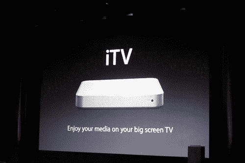

# 苹果公告概述

> 原文：<https://web.archive.org/web/http://www.techcrunch.com:80/2006/09/12/apple-announcements-overview/>

# 苹果公告概述

苹果 Showtime 活动已经结束，以下是亮点:

*   现在可以从 iTunes 上下载 75 部电影，第一周的初始费用为 12.99 美元，之后为 14.99 美元。预购的电影将是 12.99 美元，老电影将是 9.99 美元。
*   未来的版本将在 DVD 发行的同一天推出。
*   下载将需要大约 30 分钟，但可以在文件传输过程中观看。
*   图像分辨率为 640 x 480。
*   这些电影在 2007 年之前只能在美国上映。
*   电影的 DRM 和 iTunes 电视节目的 DRM 是一样的。
*   暂定名为 iTV 的无线电视机顶盒将于 2007 年第一季度推出。它将是 Mac Mini 的一半大小，将包括 USB，以太网，802.11b/g，分量视频，光学音频和 HDMI。它将由苹果遥控器控制。
*   iPod 发布的产品包括售价 4 美元的 iPod 游戏、更长的电池寿命和更亮的屏幕，以及起价 249 美元的 80GB 型号。
*   新款 Nanos 将有 5 种新颜色，电池续航时间为 24 小时，容量高达 8GB。
*   Shuffle 已经完全重新设计，现在配有铝制外壳，售价 79 美元。

更多细节请查看 [CrunchGear 对此次活动](https://web.archive.org/web/20220818040412/http://crunchgear.com/2006/09/12/its-showtime/)的现场报道。苹果能在 iTunes 商店中添加更多电影吗？还是制片公司会继续在细节上争论不休？这是仍然存在的最大问题之一。就在我们说话的时候，视频点播的早期历史正在形成。
 **更新:** [迈克尔·阿灵顿的活动照片在这里](https://web.archive.org/web/20220818040412/http://flickr.com/photos/michaelarrington/tags/apple/)。