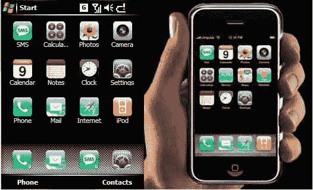

# 苹果又欺负博主了 TechCrunch

> 原文：<https://web.archive.org/web/http://www.techcrunch.com:80/2007/01/13/apple-bullies-bloggers-again>

# 苹果又欺负博主了

苹果公司有利用律师对抗博客作者的历史。还有现在臭名昭著的 [Think Secret](https://web.archive.org/web/20221206173025/http://informationweek.com/story/showArticle.jhtml?articleID=57701119) 诉讼案，可能也有可取之处。但他们也参与了明显多余的欺凌策略。8 月份，我们收到了苹果律师[的一封信，要求](https://web.archive.org/web/20221206173025/http://www.crunchnotes.com/?p=268)删除嵌入的 YouTube 视频，该视频展示了 OSX 10.5 的功能。我们认为这是一个极端的立场——苹果可以简单地要求 YouTube 删除该视频。这不是商业秘密问题——他们在自己的网站上也有一个非常相似的视频。

今天，苹果正在对一些博客作者采取类似的策略，这些博客作者只是报道了有人为 Windows Mobile 手机制作了一个看起来与新的 [iPhone 用户界面](https://web.archive.org/web/20221206173025/http://www.beta.techcrunch.com/2007/01/09/apple-announces-iphone-stock-soars/)一模一样的皮肤。看上面的图片 Windows 版本在左边，苹果版本在右边。

违规下载页面[在这里](https://web.archive.org/web/20221206173025/http://forum.xda-developers.com/showthread.php?p=1097832#post1097832)(该软件现已下架)。博客作者 Paul O'Brien 简单地链接到这个下载页面，并附上了用户界面的截图，还收到了苹果律师的停止函。

我认为这完全是胡说八道。如果苹果公司想追查那个制作了看起来像 iPhone 的 Windows Mobile 皮肤的家伙，没问题。但是欺负仅仅报道此事的博主就是另一回事了。

在 [TechMeme](https://web.archive.org/web/20221206173025/http://www.techmeme.com/070113/p23#a070113p23) 上有更多关于这个故事的报道。据我所知，这个软件已经不能在任何地方下载了。如果不正确，请告诉我们。
 ***更新:**平行发行[此处](https://web.archive.org/web/20221206173025/http://www.tuaw.com/2007/01/13/iphony-launcher-for-palm-os/)——这次为掌中。我想苹果也会打击任何报道此事的人。*