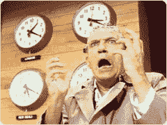

# 憎恨苹果的人:展示你自己

> 原文：<https://web.archive.org/web/http://techcrunch.com:80/2007/05/31/apple-hater-show-yourself/>

读者:在发布了一个关于 iPhone 的[小故事后，我们收到了这个极好的评论。疯狂的评论者——你是谁？告诉我们你的故事。我保证给你一个公平的待遇。请发邮件至 tips @ crunchgear dot com 联系我们。](https://web.archive.org/web/20140407051448/http://crunchgear.com/2007/05/31/iphone-draught-in-the-works/)

> 我通常不会在一个愚蠢的博客上发表评论，但你的行为如此激怒史蒂夫·乔布斯，我不得不这样做。
> 
> 史蒂夫:这是一个承诺。我会尽一切可能让正义得到伸张，让你因抢劫我而面临刑事起诉。你，拉里，如果她是同谋，还有吉娜。你们这些肮脏的混蛋。
> 
> 我向你保证:你将因向 USPTO 提交伪证专利申请而面临联邦指控，与你合谋的 Matt Powers 和他在 WG&M 的不诚实的合伙人将面临 RICO 法令的起诉。

> 我将帮助摩托罗拉、Palm、RIM、VerizonWireless、Sprint 以及任何其他因你的犯罪活动而受到不可挽回的伤害的人，获得禁止你销售 iPhone 的禁令。
> 
> 世界真大，史蒂夫。不是每个人都站在你这边。尽管你可以收买许多人来帮助你犯罪，但总有人是不能被收买的。就我而言，我从来不在乎钱。因此，在你被绳之以法之前，我不会罢休。
> 
> 吉娜·史密斯，拉里·埃里森，史蒂夫·乔布斯，史蒂文·里齐，斯蒂芬·d·卡恩，你他妈的知道我是谁。
> 
> 我会抓到你的！！！！