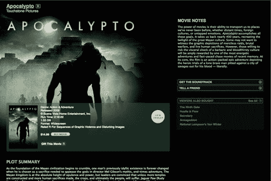

# 苹果正在商谈今年秋天推出 iTunes 电影租赁服务

> 原文：<https://web.archive.org/web/http://techcrunch.com:80/2007/06/11/apple-in-talks-to-launch-itunes-movie-rental-service-this-fall/>

# 苹果公司正在商谈今秋推出 iTunes 电影租赁服务

苹果公司希望在秋季推出 iTunes 电影租赁服务，目前正在与几家好莱坞电影公司讨论这一可能性。报告显示，苹果公司希望收取每 30 天 2.99 美元的可下载租赁费，并且下载将被 DRM“像哇一样”(m 措辞)，以防止狡猾的盗版者进一步分发下载的文件。是的，好吧，这个文件能防 T7 Snapz Pro T8 吗？

原因是苹果现在认为，虽然人们喜欢拥有他们的数字音乐，但他们不一定想拥有数字电影，特别是因为他们只看几次。3 美元租 30 天，还是 15 美元以上买一些你只会寄几次的东西？苹果公司借此提醒有线电视公司和他们的视频点播。

[好莱坞电影公司与苹果公司进行视频会谈](https://web.archive.org/web/20130628205556/http://www.ft.com/cms/s/b08aba9c-1773-11dc-86d1-000b5df10621.html)【金融时报 via [AppleInsider](https://web.archive.org/web/20130628205556/http://www.appleinsider.com/articles/07/06/10/apple_shooting_for_autumn_launch_of_film_rental_service_report.html)