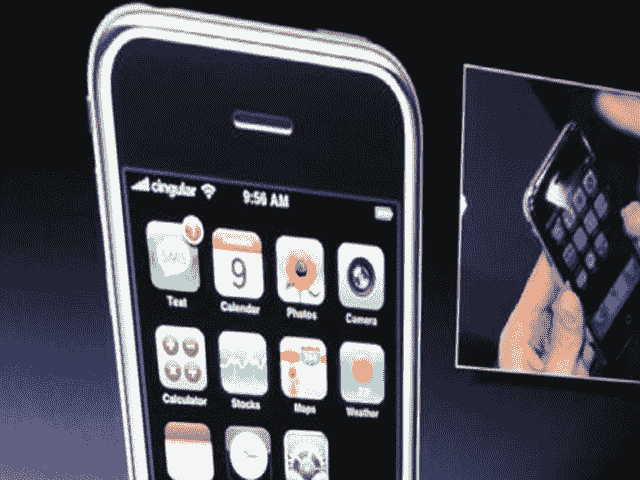

# 苹果 iPhone 常见问题解答–TechCrunch

> 原文：<https://web.archive.org/web/http://techcrunch.com:80/2007/01/10/apple-iphone-faq/>

我刚刚完成了对一些 Cingular iPhone 用户的采访，他们透露的信息足以让我们编辑一个关于苹果和 Cingular 之间寄生关系的快速常见问题。

**我是 X 用户。我能得到一部 iPhone 吗？**T5 `If X=Cingular then
true
else
false;` 

**还会有其他 iPhones 吗？**

大概吧。想想 Nano 与视频和 Shuffle 的对比。会发生的。

**我能得到一部不带手机的 iPhone 吗，也就是说，我能得到触摸屏视频 iPod 吗？**

Cingular 不知道，但如果发生了，不要指望他们会大打出手。

**谁在最初阶段接触了谁？**

乔布斯在 ROKR 上与他们的团队合作后接触了 Cingular，这是合作关系出现严重问题的一个光辉例子。然而，ROKR 是摩托罗拉的错，我们可以假设他的工作原谅了承运人。

**上市时会有多少部 iPhones？**

乔布斯说，他预计第一年将售出 1000 万台。会发生吗？不，但他们不会尝试。6 月 1 日你能买到吗？大概不会。预计等候名单会很长。

那么他们真的要在 2007 年 6 月 1 日发布了？

据 Cingular 所知，他们会的。苹果很少宣布它不能交付的东西，尽管他们最近一直在“预发布”像 Apple TV 这样的东西，这让我们暂停。

**是否通过 Wi-Fi 同步？**

还没有，但他们不排除这种可能性。从现在开始，它是“侧装式”的，这意味着你要插上一根 USB 线。

我相当足智多谋。我将解锁它并使其与 carrier X 一起工作。但是我将缺少什么？

显然，你只会错过视觉语音邮件工具。假设还会有运营商特定的数据通过管道传输，这些数据在解锁的手机上可能有用，也可能不可用。

这部手机是给我奶奶的吗？

不，除非你奶奶一年挣 10 万美元，还开 SUV。这是高端产品。

**所以 iPhone Nano 出来的时候会上 T-Mob…**

没有。抱歉打断你，但在可预见的未来，它是苹果+Cingular=iPhone。

Cingular 从中获得了什么？数十亿美元的收入和在几年的缓慢增长后的一剂强心针。当谈到智能手机消费者时，他们现在是树上的大猴子。从现在到 6 月，看看智能手机的销量吧——它们会像内华达沙漠一样平坦。

苹果从中获得了什么？

Cingular 首席执行官送的精美礼品篮。老实说，Cingular 还能给他们提供什么呢？

即使他们还没有与思科解决问题，他们会称之为 iPhone 吗？

这是一个很好的问题。看看独立电视台。如果一切都不顺利，他们总是可以求助于苹果手机。球还是在苹果这边。

**OS X 在打电话？这是什么？**

OS X 的底层操作系统 Darwin 基于 BSD。BSD 内核足够小，可以安装在 MP3 播放器和电动牙刷上。所以一般来说，iPhone 将运行 OS X，尽管有一个完全不同的用户界面层。因此，它将拥有一个真正的 OS X 版本，而不是像 MS Mobile 5.0 那样的半吊子块状 OS。