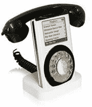

# 苹果 iPhone 到 Cingular？

> 原文：<https://web.archive.org/web/http://techcrunch.com/2006/09/26/apple-iphone-to-cingular/>

# 苹果 iPhone 到 Cingular？

据 Think Secret 报道，苹果和 Cingular 签署了一项协议，允许运营商在 2007 年的六个月内独家提供 iPhone。据称，在 6 个月的独家协议之后，其他运营商将能够销售 iPhone。

他们还表示，iPhone 将是一款直板手机，配有 2.2 英寸显示屏和 300 万像素摄像头。当然，它将与 iTunes 完全整合。我想知道它是否会得到 HSDPA 的支持，因为 Edge 毫无价值。哦，苹果公司还估计仅 2007 年一年就将出货 2500 万台。

[苹果 iPhone 将在发布会上成为 Cingular 独家](https://web.archive.org/web/20201130080637/http://www.thinksecret.com/news/0609cingulariphone.html)【想想秘密】