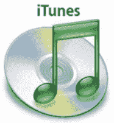

# 苹果 iTunes 销售前 30 亿首歌曲

> 原文：<https://web.archive.org/web/http://techcrunch.com/2007/07/31/apple-itunes-sales-top-3-billion-songs/>

# 苹果 iTunes 销售前 30 亿首歌曲

当年，苹果在 iTunes 上卖出了 10 亿首歌曲，全世界都在庆祝。嗯，不完全是，但是整个场合的气氛非常愉快。现在，苹果已经坚持到底，在 iTunes 上卖出了超过 30 亿首歌曲。这还不包括视频和游戏！看起来乔布斯公司还会有更多年的疯狂盈利。

[苹果称 iTunes 歌曲销量突破 30 亿首](https://web.archive.org/web/20130628172037/http://today.reuters.com/news/articlenews.aspx?type=technologyNews&storyid=2007-07-31T124846Z_01_WEN9892_RTRUKOC_0_US-APPLE-ITUNES.xml)【路透社】