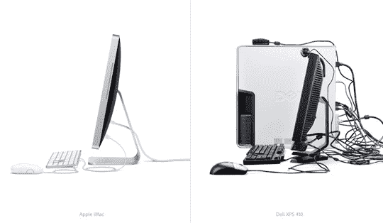

# 苹果喜欢不恰当的比较:iMac 与戴尔 XPS 410

> 原文：<https://web.archive.org/web/http://techcrunch.com/2007/08/07/apple-loves-inappropriate-comparisons-imac-vs-dell-xps-410/>

苹果公司毫不隐晦地说，“如果我们的竞争对手的生命依赖于此，他们就无法设计出一台外观漂亮的电脑。”

工业设计师大作战！

但是，就像 Josh 刚刚指出的那样，戴尔机箱不是可扩展的吗？我们来比较一下企鹅和秃鹰怎么样？我是说，它们都是鸟…

[iMac 设计](https://web.archive.org/web/20160422060811/http://www.apple.com/imac/design.html)【苹果】