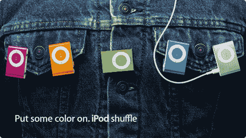

# 苹果推出多色 iPod Shuffles | TechCrunch

> 原文：<https://web.archive.org/web/http://techcrunch.com/2007/01/30/apple-poops-out-multicolored-ipod-shuffles/>

该死的苹果。你确实喜欢戏弄我们，嗯？你拆了你的整个网上商店让我们都紧张起来，然后扔了一大堆彩色的 iPod 给我们，而你却笑着叫我们女孩子的名字。你现在可以挑选粉色、橙色、酸橙、蓝色和银色的 Shuffle 类似于 iMac 的原始颜色，现在都可以买到。

但是为什么之前没有发布 79 美元的 1GB MP3 播放器呢？根据一些人(主要是 Josh)的说法，秘密发布是对微软最近发布 Windows Vista 的回应。我们对此表示怀疑，但你认为呢？巧合还是对 Vista 的回应？

[苹果专卖店](https://web.archive.org/web/20140421025606/http://store.apple.com/1-800-MY-APPLE/WebObjects/AppleStore.woa/wa/RSLID?mco=FD92FBF5&nclm=iPodshuffle)