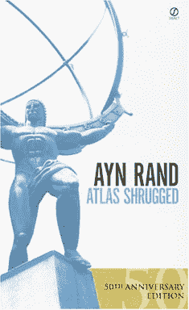

# 苹果说不要从 iTMS 购买，震惊世界

> 原文：<https://web.archive.org/web/http://techcrunch.com:80/2007/05/29/apple-says-dont-buy-from-itms-world-in-shock/>

称我的头衔有点骗人，但这是真的。苹果公司告诉 iPod 用户不要从 iTunes 音乐商店购买有声读物。原因？iTMS 上销售的有声读物的一个缺陷是不能在 iPod 上播放文件。它们在 iTunes 中运行良好，但是放到你的 iPod 上就不行了。

苹果公司目前正在退款给任何购买了有声读物的人，并告诉顾客在修复问题时要放松。也许苹果应该解决这个问题，因为如果他们不这样做，我认为 Audible.com 将会在这个漏洞生效的每一天获得更多的顾客。

[苹果建议 iPod 用户不要购买有声读物](https://web.archive.org/web/20160421205143/http://ilounge.com/index.php/news/comments/apple-recommends-ipod-owners-not-buy-any-audiobooks/)