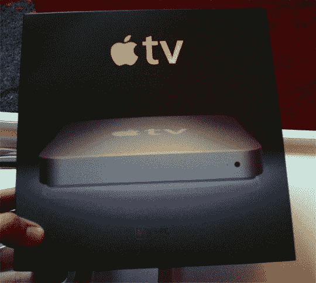

# 苹果电视免费| TechCrunch

> 原文：<https://web.archive.org/web/http://techcrunch.com/2007/04/06/apple-tv-free-for-all/>

# 苹果电视免费

我一直在关注所谓的苹果固件反黑客更新，我很高兴地说，我拒绝发布关于[苹果如何反对 hax0rs](https://web.archive.org/web/20130628160523/http://crunchgear.com/2007/03/29/apple-hacks-our-hacks/) 的 15 件事得到了 Engadget 和其他一些人的验证。简而言之，苹果不在乎你用你的苹果电视或者任何设备做什么，但是如果你用你的垃圾，不要来天才吧发牢骚。

这是一个常识:Apple TV 不依赖于苹果提供的任何服务，除非你把 iTunes 算在内，而且他们不会从进入该设备的数据流中赚钱，除非你把 iTunes 算在内。简而言之，苹果电视就像 iPod、PDA 或个人电脑一样——开始吧，少先队员。

[苹果没有反击苹果电视黑客](https://web.archive.org/web/20130628160523/http://www.engadget.com/2007/04/05/apple-not-fighting-back-against-apple-tv-hacks/)