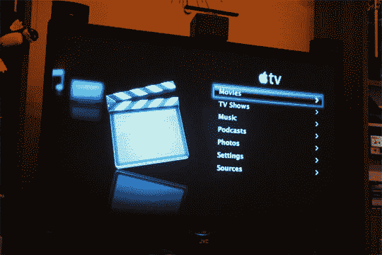

# 苹果电视操作系统周末泄露

> 原文：<https://web.archive.org/web/http://techcrunch.com:80/2007/03/26/apple-tv-os-leaked-over-the-weekend/>

你给一只狗一根骨头，它会带着一份你知道的苹果电视操作系统回来。基本上，在周末，有人发现 Apple TV 运行的是 OS X 的精简、修改版本。很惊讶，对吗？现在我们还不确定是怎么做到的，但有人创建了苹果电视操作系统的磁盘映像，并将其供下载。当然现在，链接已经关闭了，这个家伙就要被苹果起诉了。

幸运的是，有一种叫做[比特洪流](https://web.archive.org/web/20150930101748/http://www.bittorrent.com/)的东西，如果你足够努力地寻找，你很可能会找到磁盘镜像的洪流。PPC 用户，你解决了这个问题；苹果电视的操作系统是英特尔独有的。修补匠们，启动你们的 XCode…

[苹果电视操作系统](https://web.archive.org/web/20150930101748/http://www.cramptonplatt.com/appletvos.htm)【via[Digg](https://web.archive.org/web/20150930101748/http://digg.com/apple/Apple_TV_OS_available_for_download_install_on_any_mac)