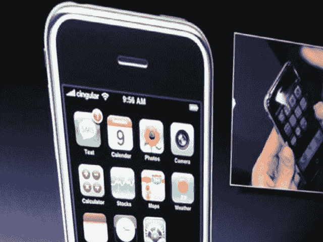

# 苹果与世界:苹果苹果手机常见问题|技术危机

> 原文：<https://web.archive.org/web/http://techcrunch.com:80/2007/02/06/apple-vs-the-world-apple-iphone-faq/>

转载自 2007 年 10 月 1 日

我刚采访了一些来自苹果公司的人，他们给了我们足够的帮助，让我们可以快速地编一个关于苹果和 Cingular 合作的寄生关系的常见问题。

**我是 X 用户。我能买一部苹果手机吗？**
 `If X=Cingular then
true
else
false;` 

**还会有其他的苹果手机吗？**

可能吧。从 Nano 与视频、Shuffle 的角度来思考。它会发生的。

**我可以买一部没有手机的苹果手机吗，比如说，买一部触屏视频 iPod？**

Cingular 不知道，但如果真的发生了，不要指望他们会大吵一架。

**初始阶段谁接近谁？**

乔布斯在 ROKR 上与他们的团队合作后联系了 Cingular，这是伙伴关系严重错误的光辉例子之一。然而，这是摩托罗拉与 ROKR 的错，我们可以假设他的工作原谅了承运人。

**发布会上将有多少款苹果手机？**

乔布斯表示，他预计第一年将售出 1000 万台。会发生吗？不，但并不是说他们不尝试。你能在 6 月 1 日买一个吗？可能不会。预计等待的人会很多。

**那么他们真的是在 2007 年 6 月 1 日发射了？**

据 Cingular 所知，他们会的。苹果很少宣布它不能交付的东西，尽管他们最近一直在“预发布”像苹果电视这样的东西，这让我们暂停。

**是否通过 Wi-Fi 同步？**

还没有，但他们不排除这种可能性。到目前为止，它是“侧面加载”的，这意味着您需要插入一根 USB 电缆。

**我足智多谋。我会解锁它，让它与 x 号航母一起工作。但是我会错过什么呢？**

显然，您只会错过可视语音邮件工具。假设还会有特定于运营商的数据，这些数据可能在解锁的手机上使用，也可能不使用。

**这是给我奶奶的电话吗？**

不，除非你奶奶年收入 10 万美元，还开着一辆 SUV。这是一种高端产品。

**所以当 iPhone Nano 面世时，它将会出现在 T-Mob 上……**

没有。很抱歉打断您，但在可预见的未来，它将是苹果+Cingular =苹果手机。

**Cingular 从中获得了什么？**
数年缓慢的增长之后，数十亿美元的收入和一剂强心针。就智能手机消费者而言，他们现在是树上的大猴子。从现在到 6 月份，观察智能手机的销售——它们将像内华达州的沙漠一样平坦。

**苹果从中获得了什么？**

来自 Cingular 首席执行官的精美礼品篮。老实说，Cingular 还能为他们提供什么呢？

即使他们还没有与思科解决问题，他们会称之为 iPhone 吗？

这是一个很好的问题。看看独立电视台。如果一切都不顺利，他们总是可以求助于苹果手机。球还是在苹果这边。

**OS X 在打电话？这是什么？**

OS X 的底层操作系统 Darwin 基于 BSD。BSD 内核足够小，可以安装在 MP3 播放器和电动牙刷上。所以一般来说，iPhone 将运行 OS X，尽管有一个完全不同的用户界面层。因此，它将拥有一个真正的 OS X 版本，而不是像 MS Mobile 5.0 那样的半吊子块状 OS。

[苹果与世界](https://web.archive.org/web/20150717170456/http://crunchgear.com/category/apple-vs-the-world/)是 CrunchGear 团队关于苹果公司现在和未来的一系列专题报道。