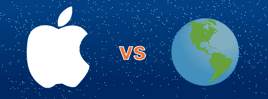

# 苹果与世界:如何转换

> 原文：<https://web.archive.org/web/http://techcrunch.com:80/2007/02/06/apple-vs-the-world-how-to-switch/>

有些人希望你相信成为 Mac 用户并不容易。忽略这些平民的说法，因为 Mac 对任何电脑用户来说都是一个伟大的平台。无论你是在做音频、视频、网页浏览，甚至是游戏(* cough *–Blake)，Mac 都能做到。此外，苹果先进的 Mac OS X 操作系统允许强大的数据控制。在下面的指南中，我将向您展示如何在一天之内完全从 Windows 切换到 OS X，而不牺牲任何东西。

**第一步:购买苹果电脑**

所以你决定冒险在苹果电脑上投入一大笔钱。不错的选择！这是成为正式 Mac 用户的第一步。苹果公司有很多电脑可供选择，可以满足任何人的需求。如果您希望为高要求的应用程序提供动力，那么 Mac Pro 就是您想要的。这是非常昂贵的，但当配置，最终成为一个机器的怪物。然而，如果你预算有限，或者只是想尝试一下，那么 Mac Mini 是个不错的选择。它体积小，结构紧凑，价格便宜。确保自带鼠标、键盘和显示器。

全能 Mac Pro

**第二步:设置和传输**

您的旧电脑可能有一个或三个您想带到 Mac 上的文件。我将推荐两种更简单的方法来完成文件传输，而不是让您尝试将两者联网并以这种方式传输文件。你可以走 CD/DVD 刻录机的路线，以 700MB 或 4.6GB 为单位备份数据。对于硬盘上有大量电影、音乐和照片的人来说，这是最好的方式。然而，如果你是一个只有一些文档和一些其他项目的轻量级用户，你可以使用闪存盘。你可以在网上找到 1GB 的版本，价格不到 20 美元。

如何安装苹果电脑？插上键盘鼠标，插到墙上。没有驱动程序，没有升级，什么都没有。你需要的大部分东西已经在硬盘上了。

**第三步:了解自己**

既然你的 Mac 已经启动并运行，数据也已备份，是时候永远抛弃那台电脑了。为了正确学习如何使用 Mac，你需要隔离自己——这意味着暂时不要使用 Windows。启动你的 Mac，注册它，瞧，你会看到一个 OS X 桌面。这是 Finder，Mac 版的 Windows 资源管理器。底部有图标的不透明小条？那是 dock，一个应用启动器。事情看起来已经很酷了，对吧？

Mac OS X 桌面截图

**第四步:申请**

现在你的旧 Windows 程序不能在 Mac 上运行，反之亦然。这意味着你需要找到 Mac 的替代品，或者用类似 Parallels 的程序运行 Windows。如果您以前使用 Outlook，现在将使用 Mail。其他类似的程序有 iChat，一个即时通讯程序(虽然你用 Adium 会更好)，以及 iTunes，一个你可能听说过的音乐播放器和商店。你会发现，你在 Windows 上使用的几乎所有应用程序要么已经被移植到 OS X，要么已经有了替代品。花些时间在互联网上阅读新的 Mac 应用程序和 Mac 必备工具。如果你需要你的游戏补丁，Aspyr 和其他几个开发者为 Mac 开发了优秀游戏的移植。如果所有这些都失败了，你可以沉迷于在 Mac 上运行的魔兽世界。

第五步:带回家

到目前为止，您应该已经掌握了 Mac 和 OS X 的使用方法。您现在已经知道三叶草/苹果键的功能，您已经开始使用 iPhoto 来管理相机中的照片，并且您已经成功使用了 OS X 的直观用户界面。现在你已经准备好去互联网上宣布自己是一个新换的 Mac 用户了。在接下来的几个月里，你会慢慢喜欢上你的 Mac 以及它所提供的一切。无论是你想使用的杀手级音频应用程序，还是大量可用的黑客工具，OS X 和你都会做得很好。

[苹果与世界](https://web.archive.org/web/20130628172542/http://crunchgear.com/category/apple-vs-the-world/)是 CrunchGear 团队关于苹果公司现在和未来的一系列专题。