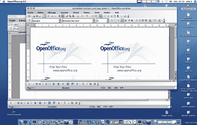

# OpenOffice 的 Aquaish 版本在 OS X 发布

> 原文：<https://web.archive.org/web/http://techcrunch.com/2007/06/05/aquaish-version-of-openoffice-is-released-for-os-x/>

谁讨厌微软 Office？谷歌文档没有帮你完成工作？嗯，Mac 用户很幸运，因为 OpenOffice 已经为 OS X 发布了一个运行在 X11 之外的 alpha 版本。OMFG！！！请记住，这是一个“阿尔法”版本，所以少了一些功能，如打印，PDF 导出和复制/粘贴。请注意:

> 该软件可能会崩溃，并可能会破坏您的数据。不要在生产环境中使用该软件进行实际工作

对于办公应用程序来说，这确实是一个悲观的决定。你们当中谁有足够的勇气为 OS X 使用 OpenOffice？！
[下载](https://web.archive.org/web/20160526214631/http://porting.openoffice.org/mac/download/aqua.html)【通过 [9to5Mac](https://web.archive.org/web/20160526214631/http://www.9to5mac.com/Open-office-org-released-for-Mac-in-Aqua)