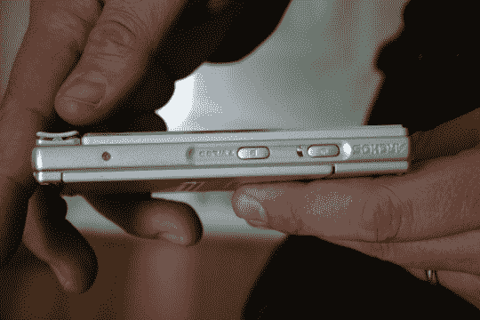
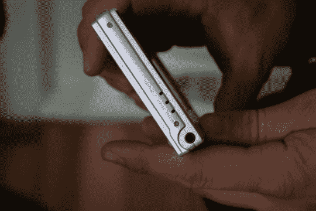
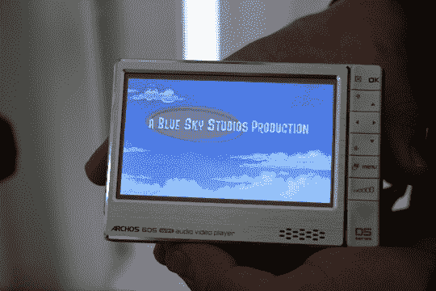
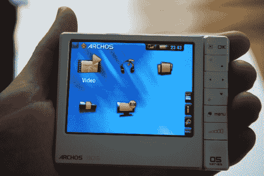
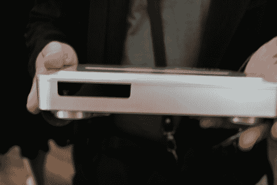
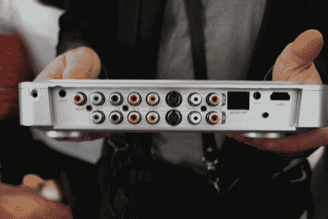

# 爱可视宣布推出 405、605 和 TV Plus 

> 原文：<https://web.archive.org/web/http://techcrunch.com/2007/06/14/archos-announces-405-605-and-tv-plus/>

CG 的男孩们刚从一个爱可视活动回来，给你带来了最新的 PMP 美食。该系列从 105 开始，但今天我们将向您简要介绍 Archos 405、605 以及 Apple TV 的新竞争对手……TV plus。

605 标配下一代爱可视设备的所有漂亮功能……

-无线网络

-容量为 4(230 美元)、30(300 美元)和 160(400 美元)

- 800 x 480 分辨率的 4.3 英寸**触摸**屏幕

- PDF 查看器

-插件(Opera 浏览器、附加编解码器)

-通过内置的 DVR 站以 VGA 分辨率(640×480)录制视频

- **高清 720p 视频播放！**(插件–额外 20 美元)

-像 YouTube 一样播放 flash 内容(插件–额外收费 20 美元)

在玩了一会儿 605 之后，我们发现它的界面非常直观，反应也非常灵敏。如果你决定沉迷于一袋奇多，通常的触摸按钮会取代触摸屏。它流畅播放 YouTube 视频的能力让我们大吃一惊，因为这是移动设备的新功能。

插件系统是一个令人印象深刻的补充，它允许播放更多的视频和音频格式，网上冲浪，甚至高清视频。每个插件花费 20 美元，但是一次性费用绝对值得。

视频播放非常流畅。

附带 DVR dock，可与可选的 QWERTY 遥控器结合使用，轻松在电视上进行网上冲浪和媒体观看。605 的小兄弟拥有相同的一般功能，但省略了 wifi、触摸屏、几个像素和一些存储空间，从而将价格降至略低于 170 美元。

它有 2gb 的容量，但有高达 16gb 的 SD 扩展

是的，我们意识到它被标注为 305。

Apple TV 的明显竞争对手 TV Plus 也使用 QWERTY 遥控器来

-数字录像机

- HDMI

- WiFi、以太网(流媒体)

-外部存储

非常感谢约翰·比格斯自愿成为我们可爱的手模！