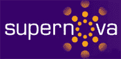

# 你是 12 强互联创新者吗？TechCrunch

> 原文：<https://web.archive.org/web/http://www.techcrunch.com:80/2007/03/26/are-you-a-top-12-connected-innovator/>

# 你是 12 强互联创新者吗？

Supernova 2007[互联创新者](https://web.archive.org/web/20130628170506/http://www.supernova2007.com/go/connected-innovators)计划的提交流程现已开始。去年我和来自 Supernova 的 Kevin Werbach 共同赞助了这个活动，我们向观众展示了一批优秀的创业公司[和](https://web.archive.org/web/20130628170506/http://www.techcrunch.com/2006/07/03/the-supernova-12/)。

它是这样运作的:公司需要在 4 月 27 日之前提交一份简短的申请，总结是什么让他们的产品具有开创性和市场价值。整个会议的主题是定义新网络。将选出 12 家公司在 Supernova 全体会议上发表演讲。我会在 TechCrunch 上报道这些演讲。被选中的公司需要支付参与费。点击[此处](https://web.archive.org/web/20130628170506/http://www.supernova2007.com/go/connected-innovators)可获得有关选择标准、营销优势和计划特点的更多详细信息。

你会熟悉去年的 12 大主持人:Attensa、Ether、Lifeio、Netvibes、PostApp、PROTOMOBL、Sharpcast、SoonR、StumbleUpon、Vpod.tv、Webaroo an Zixxo。

互联创新者展示将于 6 月 21 日在旧金山威斯汀酒店举行。

TechCrunch 的读者有资格在 6 月 20 日至 22 日期间通过电子邮件获得 200 美元的优惠。折扣将于 5 月 11 日到期。要获得折扣，请发送电子邮件[tcreg@supernova2007.com](https://web.archive.org/web/20130628170506/mailto:tcreg@supernova2007.com)索取代码。