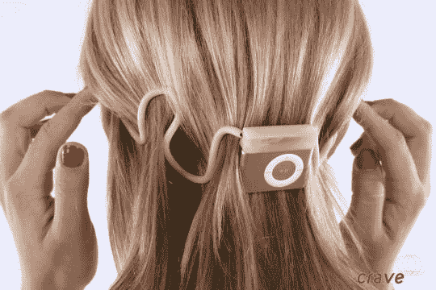

# Arriva 创造了头戴式 iPod Shuffle 

> 原文：<https://web.archive.org/web/http://techcrunch.com/2007/07/20/arriva-creates-noggin-mounted-ipod-shuffle/>

总部位于科罗拉多州的 Arriva 公司(T2)将它的帽子扔进了“无线”耳机环，这个东西看起来有点像一个 iPod Shuffle，连接着一个与耳塞相连的管道清洁器。

是的，在跑步机上处理耳机线可能会很麻烦。那是必然的。然而，把手伸到脑后，摸索着寻找下一个曲目按钮似乎看起来有点奇怪，甚至可能是危险的。

Arriva 的首席执行官说，综合考虑所有因素，最终版本将会小 30 %,可以戴在头发下面，这样就可以完全隐藏整个装置。

所以，与其看起来怪怪的摸着你的后脑勺，不如看起来像你有虱子。我开玩笑的！

Arriva 的创新值得称赞。这可能是对的东西，尤其是与锻炼人群。我们将在 5-6 周内看到产品何时开始发货。还没有定价的消息。

[Arrivas 到达:首先看看“无线”iPod Shuffle 耳机](https://web.archive.org/web/20141013162423/http://crave.cnet.com/8301-1_105-9747370-1.html)