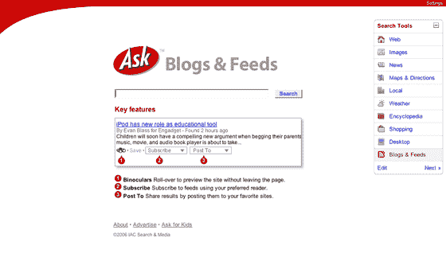

# 终于！Bloglines 博客搜索

> 原文：<https://web.archive.org/web/http://www.techcrunch.com/2006/05/31/askcombloglines-launch-blog-search/>

拥有最受欢迎的独立网络订阅阅读器 [Bloglines](https://web.archive.org/web/20220808025035/http://www.bloglines.com/) 的[Ask.com](https://web.archive.org/web/20220808025035/http://www.ask.com/)，刚刚[推出了期待已久的新博客搜索引擎](https://web.archive.org/web/20220808025035/http://blog.ask.com/2006/06/theres_blogs_an.html)。

Ask/Bloglines 在去年夏天承诺推出博客搜索引擎之后，已经成为了很多笑话的主题。新的引擎应该让那些笑话停止。该公司非常认真地对待产品和发布——本周早些时候，Ask.com 首席执行官 Jim Lanzone 亲自向我介绍了这款产品。

搜索引擎有两个独立的用户界面。它可以在[Ask.com](https://web.archive.org/web/20220808025035/http://www.ask.com/)主页(右边栏链接到博客搜索)以及[博客在线](https://web.archive.org/web/20220808025035/http://www.bloglines.com/)上找到。尽管两个站点上的界面和功能略有不同，但底层引擎是相同的。

**Ask.com 博客搜索**

可以通过“帖子”、“供稿”或“新闻”进行搜索。新闻选项从 7，000 个预先批准的博客和新闻网站中进行搜索，以减少噪音。

结果可以缩小到一个特定的时间段(任何时候，最后一个小时，上周等)，并可以按相关性，日期或受欢迎程度排序。“受欢迎程度”是根据他们的“专家排名”算法和博客数据的几个来源确定的，如订户数、链接、引用等。Bloglines 上有更多链接和更多订阅者的博客会比其他博客更有相关性。“相关性”包括受欢迎程度和新鲜度，以给出有意义的最新结果。

还有许多其他值得注意的特性。与查询相关的提要和订阅的 RSS 信息都列在右边栏中。每个搜索结果还包含额外的选项:一个双筒望远镜图形(滚动以弹出结果的最后五篇文章)、“保存”(将结果保存到剪贴板)、订阅(订阅源阅读器)和发布到(Digg、Delicous、Newsvine 等)。).

通过屏幕顶部的 javascript 下拉菜单可以访问高级搜索功能。

**Bloglines 博客搜索**

Bloglines 使用与 Ask.com 相同的后端搜索引擎，尽管界面和功能集有显著的不同。一个关键特征是每个结果旁边有一个“+”按钮。点击按钮，整篇文章以原始格式呈现(实际上不是原始格式，但非常接近)。

另一个不同点是——每个结果都有一个“更多信息”链接，显示该博客的博客订阅人数和该帖子的引用次数。
 **我对关联性的思考:**

博客搜索相关性非常需要相当于谷歌页面排名的东西。对一篇文章进行链接分析是行不通的——内容太新鲜，无法产生有意义的链接分析结果。现在有三个关于相关性的实验正在进行:Technorati 将相关性完全建立在博客的“权威”基础上，这是根据博客本身的唯一入站链接计算的。这在大多数情况下是可行的，但是很容易出问题。举个例子，TechCrunch 可以是我写的所有内容中评分最高的博客，不管我是否了解它。例如，如果我写了一篇关于政治问题的博文，它会出现在搜索结果的顶部，尽管我没有资格这么做。Bloglines 采取了一种不同的方法，将 Bloglines 用户、链接分析和其他信息等统计数据考虑在内。这可以消除或减少非特定主题的技术权威问题。 [Sphere](https://web.archive.org/web/20220808025035/http://www.beta.techcrunch.com/2006/05/01/new-blog-search-engine-sphere-launches/#comments) 正在努力为某个特定主题的博客赋予真正的权威。他们查看进出链接，以及博客本身的语义分析。理论上，在 Sphere 上，在一个领域相关的博客在另一个领域是不相关的。这是一个很好的理论，在实践中也可能随着时间的推移而发挥作用。但是博客搜索相关性之战还远未结束，我期待随着时间的推移会有新的实验。

