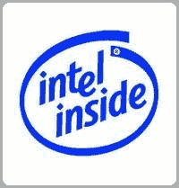

# 华硕、英特尔联手推出 199 美元笔记本电脑——TechCrunch

> 原文：<https://web.archive.org/web/http://techcrunch.com:80/2007/06/05/asustek-and-intel-team-up-for-199-laptop/>

# 华硕、英特尔联手推出 199 美元笔记本电脑

虽然目前正在进行的 OLPC 倡议是一项非常崇高的努力，但它的目标主要是发展中国家和几乎没有技术的第三世界国家。然而，英特尔和华硕正在寻找一种廉价的笔记本电脑，带给学校、新兴市场和那些破产的人。

华硕将生产和销售英特尔目前向学校提供的学生电脑系列笔记本电脑。这款 199 美元的笔记本电脑将采用英特尔 CPU，7 英寸或 10 英寸屏幕，Wi-Fi，固态硬盘，以及 Linux 或 Windows XP。目前还不知道是否会向普通大众提供这些廉价的笔记本电脑，但如果华硕和英特尔聪明的话，他们会把它们推销给买不起电脑或互联网的低收入家庭。发布日期尚未公布。

[华硕和英特尔正在开发 199 美元的笔记本电脑](https://web.archive.org/web/20210302013218/http://news.yahoo.com/s/infoworld/20070605/tc_infoworld/89101)【雅虎！新闻]