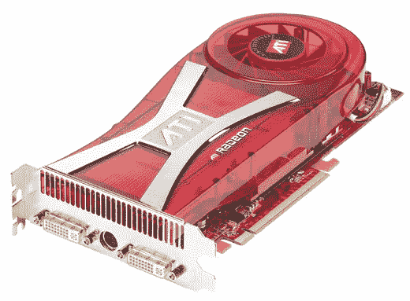

# ATI 镭龙 X1950 XTX 织机–TechCrunch

> 原文：<https://web.archive.org/web/http://techcrunch.com/2006/08/23/ati-radeon-x1950-xtx-looms/>

# ATI 镭龙 X1950 XTX 织机

9 月 14 日，ATI 将发布其新的旗舰卡。据称，镭龙 X1950 XTX 在“超高清”分辨率方面的表现优于其最接近的竞争对手 GeForce 7950 GX2，而只使用了一半的处理器。它可以单独运行，或在交叉火力模式下与另一个 x1950 XTX 配对，以提供更高的性能。

据我所知，X1950 XTX 使用双 GPU 和 GDDR4，数据速率为 2Ghz。不幸的是，新闻稿主要使用了大量劝诫性的语言，很少提供可靠的技术数据。然而，它确实指出，镭龙 X1950 XTX 的零售价为 449 美元，并将很快在部分戴尔机器上提供。
 [ATI 为游戏玩家释放新的性能王者:介绍镭龙 X1950 XTX](https://web.archive.org/web/20210302023921/http://ir.ati.com/phoenix.zhtml?c=105421&p=irol-newsArticle&ID=898452&highlight=)