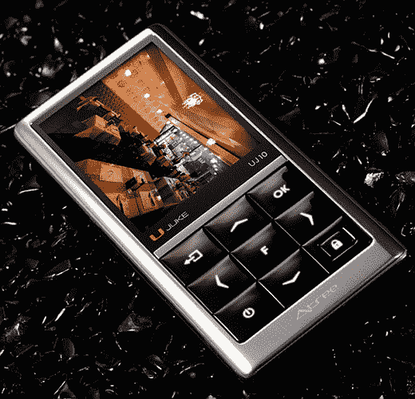

# Atree UJ10 便携式媒体播放器:又一个高质量的韩国专用玩具

> 原文：<https://web.archive.org/web/http://techcrunch.com:80/2007/04/16/atree-uj10-portable-media-player-yet-another-quality-korea-only-toy/>

# Atree UJ10 便携式媒体播放器:又一款韩国独有的高品质玩具

在韩国这片神秘的土地上，Atree 有一款看起来相当温和的便携式媒体播放器——UJ10——让它的设计成为话题。这是因为该功能集相当基本:它播放 MP3 等大型音频格式；MPEG-4 和 WMV9 视频；JPEGs 和其他图片格式；调频广播和 DMB 电视台。最后一个意味着这是韩国独有的。嘘。

2.2 英寸的屏幕被一个看起来很坚固的边框包围着，可以在横向或纵向模式下观看。总的来说，它看起来像一个糖果棒手机，我不介意使用。

至少我们在美国还有超酷的 Zune(T4)

[产品页面](https://web.archive.org/web/20130628160903/http://www.atree.com/notice/notice_read.asp?Menucategory=1&mvalue=notice_list&svalue=sb3&boardno=194)【Atree via[Akihabaranews.com](https://web.archive.org/web/20130628160903/http://www.akihabaranews.com/en/news-13638-A+SWEET+PMP+DMB+by+Atree.html)