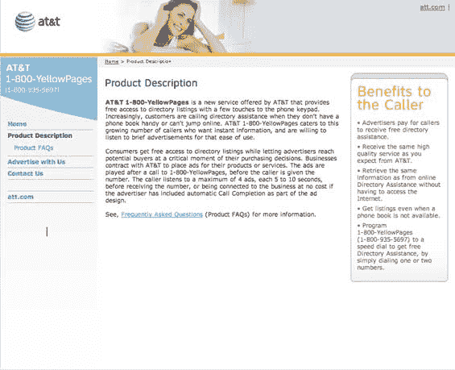

# 美国电话电报公司收购 InFreeDA，进入免费 411 业务——TechCrunch

> 原文：<https://web.archive.org/web/http://www.techcrunch.com:80/2006/12/26/att-acquires-infreeda-gets-into-free-411-business/>

# 美国电话电报公司收购英弗里达，进入免费 411 业务

叮当的 800-免费-411 服务取得了巨大的成功，它允许人们获得 411 信息，而不需要手机运营商和其他电话公司收取高昂的费用(每次通话高达 3.5 美元)，这终于引起了至少一家大公司的注意。在& T 收购了 [InFreeDA](https://web.archive.org/web/20210618035930/http://www.infreeda.com/) ，它是叮当的竞争对手，也是 800-411-Metro 服务的运营商，收购金额未披露，[宣布](https://web.archive.org/web/20210618035930/http://www.att.com/Common/1800yellowpages/product_description.htm)提供免费的 411 服务。

叮当的成功意义重大。他们已经筹集了超过 6000 万美元，并迅速占据了美国 411 市场的 3%。迄今为止，叮当已经接听了超过 1 亿个 411 电话。10 月份，我们采访了叮当网络公司首席执行官乔治·加里克和投资人乔希·科佩尔曼。我们之前在 TechCrunch 上的报道是这里的。

美国电话电报公司的服务将在 800 页的黄页上提供，看起来非常相似，尽管它目前只在加利福尼亚州的贝克斯菲尔德、俄克拉荷马州的俄克拉荷马市和俄亥俄州的哥伦布市提供。然而，美国电话电报公司将播放多达四个广告，每个 5-10 秒，而不是一个广告。这要求他们的许多客户(在给出信息之前有长达 40 秒的广告)，但美国电话电报公司可能能够基于信息质量进行竞争，这是叮当过去一直受到批评的地方。800 页黄页的主要产品页面是[这里是](https://web.archive.org/web/20210618035930/http://www.att.com/Common/1800yellowpages/product_description.htm)，常见问题是[这里是](https://web.archive.org/web/20210618035930/http://www.att.com/Common/1800yellowpages/product_description.htm)。

