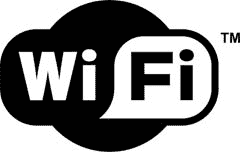

# 美国电话电报公司为欧洲增加更多无线网络

> 原文：<https://web.archive.org/web/http://techcrunch.com/2007/08/06/att-adds-more-wifi-to-europe/>

# 美国电话电报公司为欧洲增加更多 WiFi

这里没什么特别的，只是对那些将来住在或去欧洲的人来说是个好消息。美国电话电报公司已经与云合作，在欧洲提供超过 9000 个新的 WiFi 热点，使 WiFi 点的总数达到约 37000 个。非常好。

[AT & T 扩大 Wi-Fi 接入](https://web.archive.org/web/20130628211840/http://www.prnewswire.com/cgi-bin/stories.pl?ACCT=109&STORY=/www/story/08-06-2007/0004639701&EDATE=)