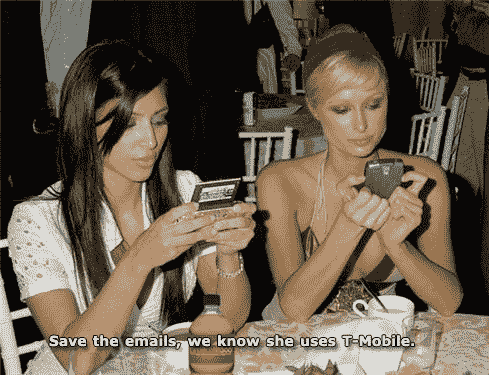

# 美国电话电报公司添加无限消息捆绑包，最终

> 原文：<https://web.archive.org/web/http://techcrunch.com:80/2007/05/01/att-adds-unlimted-messaging-bundles-finally/>

我们都支持可以用“沉重”和“责任”两个词来形容的东西，美国电话电报公司的新信息计划(不再是 Cingular 了，伙计)就是这样。19.99 美元一个月，你就可以随心所欲地发短信、发图片、发视频，还可以用手机发即时消息。这个计划并不适合每个人，但是对于我们这些使用文本多于分钟的人来说，这是天赐之物。

同时公布的还有类似的网络短信计划，价格低至 5 美元。虽然这对公司或家庭计划来说是好的，但所有人的计划更有价值。当然，这要多花 15 美元，但对我们来说，知道你不必把每一篇文章都制成表格，这种内心的平静值一个比萨饼的价格。

[竖起大拇指！AT & T 宣布无限短信计划](https://web.archive.org/web/20160421081806/http://www.mobileburn.com/pressrelease.jsp?Id=3330)