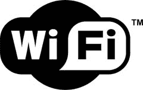

# 美国电话电报公司将为比你更好的人提供免费 Wi-Fi

> 原文：<https://web.archive.org/web/http://techcrunch.com/2007/07/03/att-to-offer-people-better-than-you-free-wifi/>

你用美国电话电报公司来满足你所有的宽带需求吗？如果是这样的话，你将会得到美国电话电报公司有史以来最好的礼物。美国电话电报公司正在向其帐户上拥有 Pro、Elite 或 FastAccess 服务的 DSL 用户提供免费 Wi-Fi 接入，覆盖全国 10，000 个热点中的任何一个。

通常情况下，这项服务的 24 小时连接费用为 7.99 美元，可以在全国各地的机场、麦当劳和 Barnes & Nobles 找到。所以，如果你仔细想想，美国电话电报公司对你很好，给了你一笔特别好的交易。我猜随着[超过 500，000 台 iPhones 在](https://web.archive.org/web/20150115225446/http://crunchgear.com/2007/07/02/over-500000-iphones-sold/)售出，在& T 有一点钱可以挥霍。

美国电话电报公司为一些顾客提供免费无线网络【美联社】