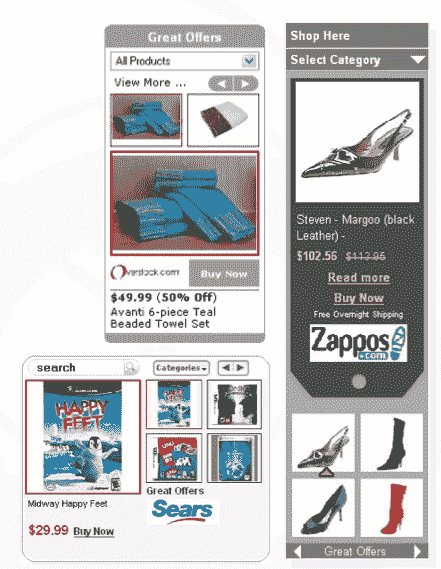

# 广告插件的攻击——TechCrunch

> 原文：<https://web.archive.org/web/http://www.techcrunch.com:80/2007/05/06/attack-of-the-advertising-widgets/>

# 广告插件的攻击

  小配件正被变成广告投放系统。它们的性质——易于构建、定制和添加到网站的富媒体应用程序——也使它们成为向小型网站添加广告的一种有吸引力的方式。谷歌现在正在测试[小工具广告](https://web.archive.org/web/20220813133854/http://publications.mediapost.com/index.cfm?fuseaction=Articles.showArticleHomePage&art_aid=59817)，我们已经写过类似 [boobox](https://web.archive.org/web/20220813133854/http://www.beta.techcrunch.com/2007/01/21/boobox-to-help-bloggers-sell-stuff/) 和 [AuctionAds](https://web.archive.org/web/20220813133854/http://www.beta.techcrunch.com/2007/03/06/just-launched-auctionads-ebay-advertising-widget/) (赞助商)这样的服务，它们可以通过小工具轻松地在网站上投放联盟广告。上周[易贝也推出了“to go”widgets](https://web.archive.org/web/20220813133854/http://www.beta.techcrunch.com/2007/04/30/ebay-launches-togo-widgets-for-any-listing/)，允许出版商将易趣的列表嵌入网站，尽管目前这些 widgets 还没有关联支付。

这周还有两个要来。今晚，总部位于硅谷的 Tumri 将发布一款名为 Tumri Publisher 的新产品，西雅图的 Mpire 将于本周晚些时候发布一款广告插件。

Tumri Publisher(这里称为)允许用户创建高度可定制的小工具，在他们的网站上推广特定产品，以换取会员或其他费用。Tumri 与 Overstock、沃尔玛、Shop.com 等电子商务网站有大约 20 个直接关系，以推广他们的产品。尽管至少有一个合作伙伴为他们网站的每次点击付费，但大多数广告是按购买付费的。

Tumri 将广告收入与广告分成 50/50，他们表示将向更大的出版商支付高达 70%的收入。

小部件是 javascript 驱动的；该公司表示，Flash 版本即将推出。

Tumri 成立于 2004 年，在 Shasta Ventures 和 Accel 的 A 轮融资中筹集了 650 万美元。他们目前正在关闭第二轮。他们有 31 名员工(16 名在印度，15 名在硅谷)。

